# TÀI LIỆU KIẾN TRÚC & TRẢ LỜI CÂU HỎI BẢO VỆ
### Hệ thống: Wisdom Social — **service-base** (Tách Monolith → 5 Microservices + 3 Shared Lib)
> Tài liệu này trả lời **toàn bộ** câu hỏi trong đề, dựa trên **đọc trực tiếp source code** của project `service-base`.
> Hình vẽ là **Mermaid (text sửa được)** — paste vào https://mermaid.live / VS Code (extension *Markdown Preview Mermaid Support*) / GitHub / Notion / draw.io.
>
> **Cách sửa hình:** mọi hình là code trong khối ```` ```mermaid ````. Sửa text → hình tự đổi, không cần phần mềm vẽ.

---

## MỤC LỤC
1. [Tóm tắt 30 giây (học thuộc)](#0)
2. [Chương trình dùng kiến trúc gì?](#1)
2b. [CÁC CHỨC NĂNG CỦA HỆ THỐNG (slide "Trình bày các chức năng")](#1b)
3. [Sơ đồ kiến trúc C4 (Context → Container → Component)](#2)
3b. [Sơ đồ cơ sở dữ liệu (ERD) — Polyglot Persistence](#2c)
4. [Công nghệ sử dụng (Tech Stack)](#3)
5. [Tại sao dùng kiến trúc đó? Có hợp lý không?](#4)
6. [Architecture Style — so sánh, nên/không nên](#5)
6b. [Tại sao kiến trúc này — KHÔNG phải Microservices thuần / Event-Driven thuần? (so sánh + test)](#5b)
7. [Architecture Characteristics (thuộc tính kiến trúc)](#6)
8. [Design Patterns đang dùng (Strangler, Hexagonal, Shared-Kernel...)](#7)
9. [Tại sao dùng Redis?](#8)
10. [CQRS — tại sao, có hợp lý không, so sánh](#9)
11. [Event Sourcing — bạn CÓ hay KHÔNG? (rất quan trọng)](#10)
12. [Sync vs Async — dùng cả hai ở đâu](#11)
12b. [Các kỹ thuật khác (Caching, Pagination, Idempotency, Feed ranking...)](#11b)
13. [Làm thế nào để tăng Performance?](#12)
14. [DevOps](#13)
15. [Mức độ áp dụng AI](#14)
16. [Ngân hàng câu hỏi phản biện + trả lời mẫu](#15)
17. [ƯU ĐIỂM / NHƯỢC ĐIỂM (ví dụ thực tế) + HƯỚNG PHÁT TRIỂN](#16)
18. [KỊCH BẢN DEMO (gợi ý trình diễn)](#demo)

---

<a name="0"></a>
## 1. TÓM TẮT 30 GIÂY (HỌC THUỘC)

> "Hệ thống của em là một nền tảng **social/chat real-time**. Ban đầu là **monolith** (`backend`, ~438 file). Em **tách dần thành 5 microservice + 3 thư viện nền** bằng **Strangler Fig pattern**. 5 service: **media (8081), user-chat (8082), content (8083), notification (8084), ai (8085)**. 3 lib dùng chung: **common-lib** (contract: DTO + cổng `MediaStoragePort`), **persistence-lib** (entity + repository, **chung 1 DB**), **common-core** (hạ tầng: security, config, event, Redis Pub/Sub, WebSocket). Các service **giao tiếp với nhau bằng REST đồng bộ** (qua adapter), real-time đẩy qua **Redis Pub/Sub → WebSocket**. Điểm kiến trúc nổi bật là em dùng **Ports & Adapters (Hexagonal)**: business chỉ phụ thuộc interface `MediaStoragePort`, còn chạy local (S3 trực tiếp) hay remote (gọi media-service qua REST) chỉ là đổi adapter — không sửa code nghiệp vụ."

**3 con số / tên nên nhớ:**
- **5 service + 3 lib**, chạy chung **1 Docker container**, boot **tuần tự** (start-all.sh) để tránh OOM.
- **Chung 1 DB** (MariaDB + MongoDB + Redis) → đây là coupling có chủ đích để tách nhanh.
- Pattern lõi: **Strangler Fig + Ports & Adapters + Shared Kernel + REST + Redis Pub/Sub**.

---

<a name="1b"></a>
## 2B. CÁC CHỨC NĂNG CỦA HỆ THỐNG (slide "Trình bày các chức năng")

> Phần này trả lời câu "app của em **làm được gì**" — bắt buộc có trong slide. Mỗi nhóm chức năng gắn với service phụ trách (đúng theo cách tách trong code).

### 2B.1 — Bản đồ chức năng theo service

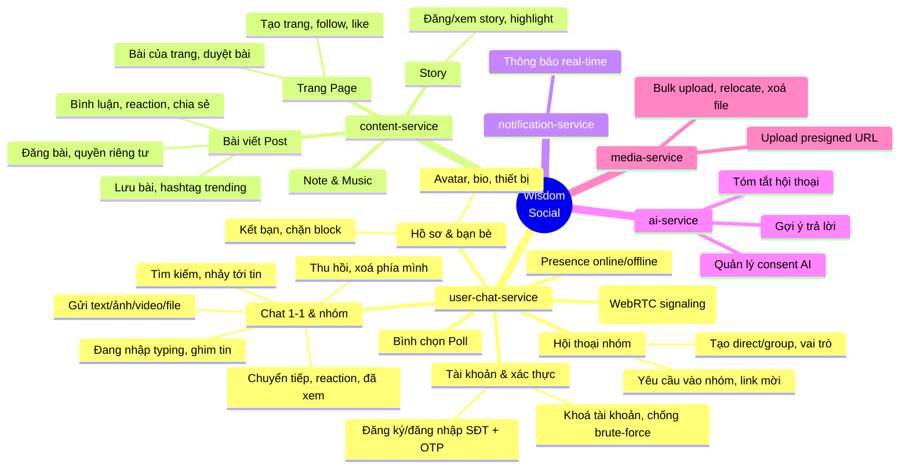

### 2B.2 — Bảng chức năng chi tiết

| Service | Nhóm chức năng | Chức năng cụ thể |
|---------|----------------|------------------|
| **user-chat (8082)** | Tài khoản | Đăng ký/đăng nhập bằng SĐT + OTP (Cognito), khoá tài khoản, rate-limit chống dò mật khẩu |
| | Hồ sơ & bạn bè | Hồ sơ (avatar/bio), quản lý thiết bị, kết bạn, **chặn (block)**, danh sách đen |
| | Nhắn tin | Gửi **text/ảnh/video/file**, **thu hồi (recall)**, xoá phía mình, **chuyển tiếp**, **reaction emoji**, **đã xem (seen)**, **đang nhập (typing)**, **ghim tin**, **tìm kiếm**, nhảy tới tin (jump), xem media của hội thoại |
| | Bình chọn | Tạo **Poll**, vote, thêm lựa chọn |
| | Hội thoại/nhóm | Tạo **chat 1-1 / nhóm**, thêm/xoá thành viên, **vai trò (admin/member)**, yêu cầu vào nhóm, ghim hội thoại, giải tán nhóm, **link mời** |
| | Real-time | **Presence (online/offline)**, tín hiệu **cuộc gọi (WebRTC)** |
| **content (8083)** | Bài viết | Đăng **Post** (quyền riêng tư public/friend/private), **bình luận**, **reaction**, **chia sẻ (share)**, **lưu bài**, hashtag trending |
| | Trang | Tạo **Page**, thành viên, **follow/like**, bài của trang, duyệt bài đăng |
| | Story | Đăng/xem **Story**, **highlight**, đếm lượt xem |
| | Khác | **Note** (ghi chú), **Music** (nhạc nền) |
| **notification (8084)** | Thông báo | **Thông báo real-time**: có người tương tác, bài mới, lời mời nhóm... |
| **ai (8085)** | AI | **Gợi ý trả lời**, **tóm tắt hội thoại**, quản lý **consent** (đồng ý dùng AI) |
| **media (8081)** | Lưu trữ | **Upload qua presigned URL** (ảnh/video/file), bulk upload, di chuyển/xoá file trên S3 |

> **Mẹo present:** Trên slide chức năng nên **demo trực quan 2–3 luồng tiêu biểu** (gửi tin nhắn real-time, đăng bài + nhận thông báo, gợi ý AI) thay vì liệt kê hết — rồi dùng bảng này làm phụ lục.

---

<a name="1"></a>
## 2. CHƯƠNG TRÌNH DÙNG KIẾN TRÚC GÌ?

Đây là **service-based / microservices được tách ra từ monolith theo Strangler Fig**, kết hợp nhiều style:

| Tầng | Style / Kiến trúc | Bằng chứng trong code |
|------|-------------------|----------------------|
| **Tổng thể** | **Microservices** (5 service deploy được độc lập) | `media-service`, `user-chat-service`, `content-service`, `notification-service`, `ai-service` (port 8081–8085) |
| **Cách hình thành** | **Strangler Fig Pattern** (monolith co dần) | `PLAN.md`: "backend đóng vai monolith co dần, mỗi stage peel 1 cụm ra" + `../backend` vẫn còn |
| **Boundary kỹ thuật** | **Ports & Adapters (Hexagonal)** | `MediaStoragePort` (interface) + `RemoteMediaStorageAdapter` / `S3MediaStorageAdapter` |
| **Chia sẻ code** | **Shared Kernel (DDD)** | 3 lib: `common-lib`, `persistence-lib`, `common-core` |
| **Giao tiếp** | **REST đồng bộ** + **Event-Driven (Redis Pub/Sub)** | `RemoteNotificationServiceImpl` (REST), `RedisChatSubscriber` (Pub/Sub) |
| **Tầng chat** | **CQRS** | `MessageCommandService` vs `MessageQueryService` |
| **Trong mỗi service** | **Layered + Modular theo domain** | `modules/user`, `modules/chat`, `modules/post`... |

> **Câu chốt khi bị hỏi "MỘT kiến trúc gì":**
> "Style chủ đạo là **Microservices**, hình thành bằng **Strangler Fig** từ monolith, với **Ports & Adapters** làm ranh giới và **Shared Kernel** để chia sẻ contract/entity. Giao tiếp **REST + Redis Pub/Sub**."

---

<a name="2"></a>
## 3. SƠ ĐỒ KIẾN TRÚC C4

### 3.1 — C4 Level 1: System Context

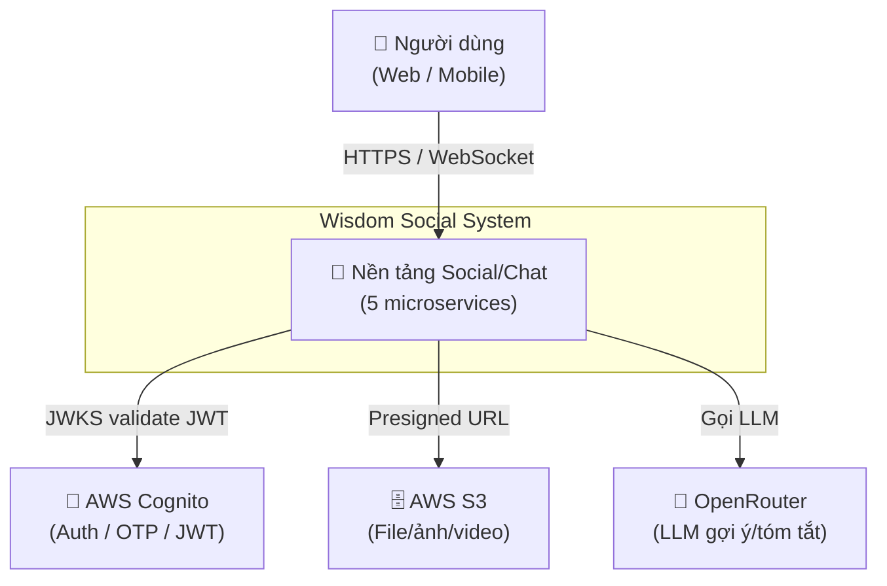

### 3.2 — C4 Level 2: Container (đây là hình quan trọng nhất)

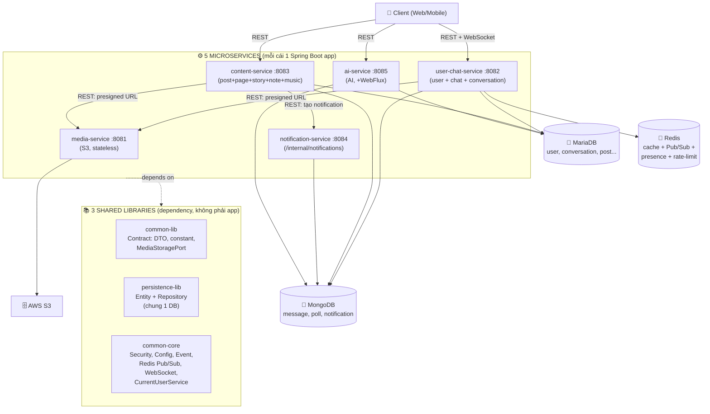

> **Điểm nhấn để khoe:** Tất cả service **dùng chung 3 lib** và **chung DB**, nhưng vẫn deploy riêng. Cross-service call **chỉ là REST khi cần gọi nghiệp vụ** (media, notification); còn đọc user thì giải **cục bộ** qua `CurrentUserService` → tránh gọi REST vòng tròn.

### 3.3 — C4 Level 3: Component — Ports & Adapters (Hexagonal)

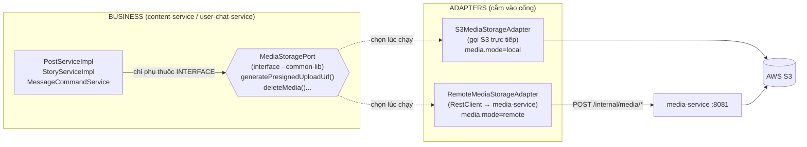

### 3.4 — Sequence: "Đăng 1 bài post có ảnh + thông báo" (luồng cross-service thật)

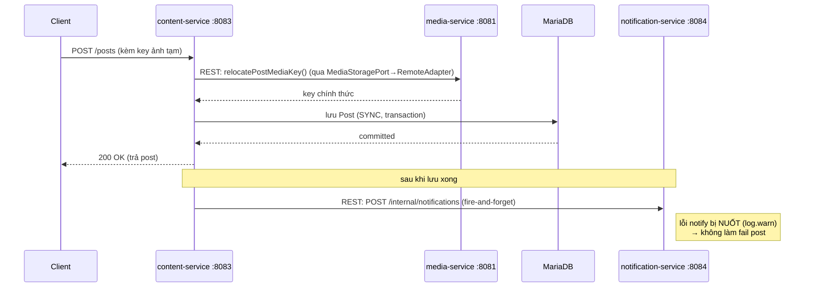

---

<a name="2c"></a>
## 3B. SƠ ĐỒ CƠ SỞ DỮ LIỆU (ERD) — Polyglot Persistence

> **Điểm đặc biệt cần khoe:** Hệ thống dùng **2 loại CSDL cùng lúc (Polyglot Persistence)**:
> - **MariaDB (quan hệ)** cho dữ liệu **ràng buộc chặt, có quan hệ** (user, conversation, member, page) — có **khoá ngoại (FK)** thật.
> - **MongoDB (tài liệu)** cho dữ liệu **ghi nhiều, schema linh hoạt, lồng nhau** (message, post, poll, notification, story) — **không có FK**, liên kết với MariaDB bằng **ID** (vd `Message.conversationId` trỏ tới `conversations.id`).

### 3B.1 — Phần quan hệ (MariaDB) — có khoá ngoại thật

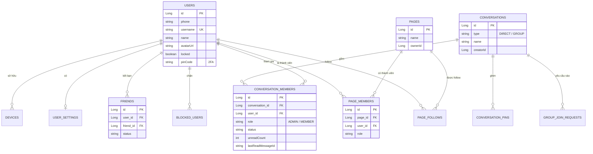

### 3B.2 — Phần tài liệu (MongoDB) + liên kết bằng ID tới MariaDB

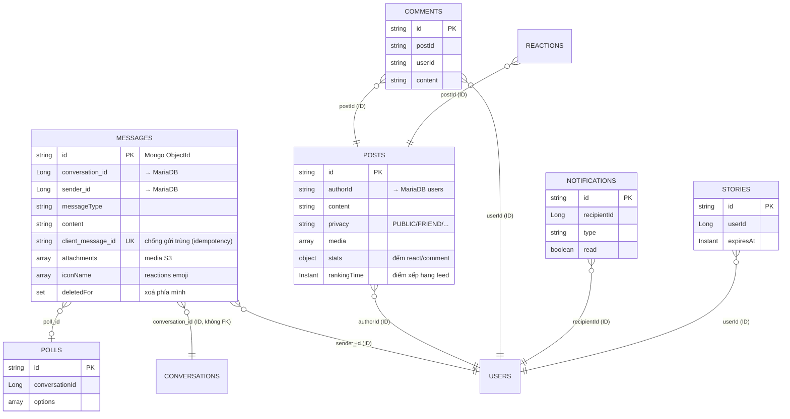

> **Câu hỏi giám khảo hay hỏi: "Sao không để hết 1 DB?"**
> → "Dữ liệu user/quan hệ/nhóm cần **ràng buộc toàn vẹn + transaction** nên dùng **MariaDB**. Còn tin nhắn/bài đăng **ghi cực nhiều, cấu trúc lồng nhau (attachments, reactions, media), schema hay đổi** → **MongoDB** hợp hơn (linh hoạt, ghi nhanh, dễ shard). Cái giá là **không có JOIN/FK xuyên 2 DB** — em liên kết bằng ID và xử lý ở tầng ứng dụng."

---

<a name="3"></a>
## 4. CÔNG NGHỆ SỬ DỤNG (TECH STACK)

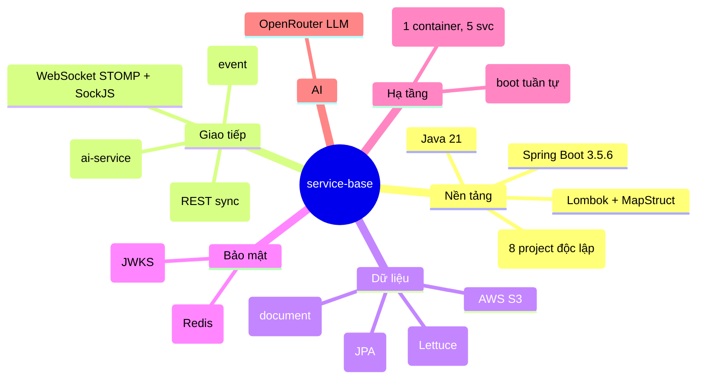

| Nhóm | Công nghệ | Vai trò |
|------|-----------|---------|
| Ngôn ngữ/Framework | **Java 21, Spring Boot 3.5.6** | Nền cả 5 service + 3 lib |
| Build | **Maven** (8 project riêng, **không** reactor) | Mỗi service ra 1 fat JAR |
| REST client | **Spring RestClient** | Cross-service (media, notification) |
| Reactive | **Spring WebFlux** | ai-service gọi LLM |
| Real-time | **Redis Pub/Sub + WebSocket (STOMP/SockJS)** | Tin nhắn, typing, presence |
| DB quan hệ | **MariaDB** (Spring Data JPA) | user, conversation, post, page... |
| DB tài liệu | **MongoDB** | message, poll, notification |
| Cache/Broker | **Redis 7.2 (Lettuce)** | cache, pub/sub, presence, rate-limit |
| File | **AWS S3** (presigned URL) | ảnh/video/file |
| Auth | **AWS Cognito + JWT (JWKS)** | đăng nhập, xác thực token |
| Mapping | **MapStruct** | entity ↔ DTO (compile-time) |
| AI | **OpenRouter** | gợi ý trả lời, tóm tắt hội thoại |
| Đóng gói | **Docker** (multi-stage) | 1 image chạy 5 service |

---

<a name="4"></a>
## 5. TẠI SAO DÙNG KIẾN TRÚC ĐÓ? CÓ HỢP LÝ KHÔNG?

### Vì sao tách monolith thành microservices (bằng Strangler Fig)?

| Lý do | Giải thích |
|-------|-----------|
| **Monolith phình to khó bảo trì** | Backend ~438 file, nhiều domain (user/chat/post/page/story/ai...) dính nhau → khó phát triển song song. |
| **Tách theo cụm coupling** | Đo coupling thật: `chat↔conversation`, `post↔notification` dính chặt → gom chung cụm; `media` sạch nhất → tách trước. |
| **Scale & deploy độc lập** | Ví dụ `media-service` stateless có thể scale riêng; `ai-service` nặng có thể tách tài nguyên. |
| **Giảm rủi ro khi tách** | Strangler Fig cho phép **tách dần từng stage**, mỗi stage verify compile, monolith vẫn chạy → không "big bang rewrite". |

### Vì sao **Strangler Fig** mà không viết lại từ đầu?

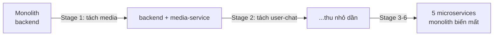

✅ **Hợp lý vì:** Viết lại từ đầu (big-bang) rủi ro rất cao, dễ vỡ. Strangler Fig **bọc dần và thay thế từng phần**, hệ thống cũ vẫn hoạt động trong suốt quá trình.

### Vì sao **chung 1 DB** thay vì mỗi service 1 DB (database-per-service chuẩn)?

⚠️ **Đây là điểm quan trọng phải thành thật:**
- **Lý do chọn:** Coupling chéo phần lớn là **entity/repository dùng chung** → tách DB sẽ phải migrate dữ liệu + viết REST cho mọi lần đọc entity → cực tốn. Chung DB giúp **tách nhanh, không migrate**.
- **Cái giá:** Đây **chưa phải microservices "thuần"** — vẫn coupling ở tầng **schema DB** (sửa bảng `users` ảnh hưởng nhiều service). Đúng hơn là **"service-based architecture"** (kiến trúc hướng service, chung DB).
- **Hướng tiến hoá:** Khi cần độc lập thật sự → tách DB theo từng bounded context (Stage tương lai).

> **Mẹo trả lời "có hợp lý không":** "Hợp lý **cho giai đoạn hiện tại** vì mục tiêu là tách module để dễ phát triển/scale mà không chịu rủi ro migrate dữ liệu. Em ý thức rõ chung DB là **trade-off** — chưa phải microservice thuần, mà là **service-based**. Đó là lựa chọn thực dụng theo Strangler Fig."

---

<a name="5"></a>
## 6. ARCHITECTURE STYLE — SO SÁNH (NÊN / KHÔNG NÊN)

### 6.1 So sánh các style

| Tiêu chí | Monolith (gốc) | Modular Monolith | **Service-based (HIỆN TẠI của em)** | Microservices thuần |
|----------|----------------|------------------|--------------------------------------|---------------------|
| Số deploy unit | 1 | 1 | **5 service + 3 lib** | Nhiều |
| Database | 1 chung | 1 chung | **1 CHUNG** ⚠️ | **Mỗi service 1 DB** |
| Scale độc lập | Không | Không | **Có (theo service)** ✅ | Có (triệt để) |
| Coupling | Rất cao | Vừa (qua module) | **DB schema** ⚠️ | Thấp nhất ✅ |
| Độ phức tạp vận hành | Thấp | Thấp | **Trung bình** | Cao |
| Rủi ro khi tách | — | Thấp | **Thấp (Strangler)** ✅ | Cao (big rewrite) |
| Phù hợp khi | App nhỏ | App vừa, 1 team | **Đang chuyển đổi, muốn scale dần** ✅ | Hệ rất lớn, nhiều team, cần độc lập tuyệt đối |

### 6.2 Nên / Không nên

✅ **NÊN chọn service-based (chung DB) như em — khi:**
- Đang **chuyển đổi từ monolith**, muốn giảm rủi ro.
- Cần **scale/deploy riêng** vài phần (media, ai) nhưng **chưa cần** tách dữ liệu.
- Team chưa lớn, chưa muốn gánh nặng quản lý nhiều DB + distributed transaction.

❌ **KHÔNG NÊN nếu:**
- Cần **độc lập triệt để** (mỗi team sở hữu DB riêng, deploy không ảnh hưởng nhau) → phải database-per-service.
- App quá nhỏ → microservices gây phức tạp thừa (nên ở monolith).

> **Ví dụ so sánh cụ thể:**
> - Nếu là app 100 user nội bộ → **monolith** đủ tốt, tách service là thừa.
> - Nếu là Netflix/Grab nhiều team → **microservices thuần (DB riêng)** mới đáp ứng.
> - Project của em ở **giữa**: đã lớn, muốn tách dần nhưng chưa cần DB riêng → **service-based + Strangler Fig** là điểm rơi hợp lý.

---

<a name="5b"></a>
## 6B. TẠI SAO KIẾN TRÚC NÀY — KHÔNG PHẢI MICROSERVICES THUẦN, CŨNG KHÔNG PHẢI EVENT-DRIVEN THUẦN?

> Đây là mục trả lời **trực diện** câu hỏi: *"Sao em không làm hẳn Microservices, hoặc làm hẳn Event-Driven, mà lại chọn kiến trúc này?"*
> **Ý chính phải nói ngay:** Kiến trúc của em **không đối lập** với 2 cái kia — nó là **bản thực dụng (pragmatic)** lấy phần tốt của cả hai và **cố ý** bỏ phần đắt đỏ chưa cần. Cụ thể: **service-based** (tách service nhưng chung DB) + **event-driven có chọn lọc** (Redis Pub/Sub chỉ cho real-time), giao tiếp nghiệp vụ vẫn **REST đồng bộ**.

### 6B.0 — Định nghĩa lại 3 lựa chọn cho rõ (tránh hiểu nhầm)

| Kiến trúc | Đặc trưng cốt lõi | Giao tiếp chính |
|-----------|-------------------|-----------------|
| **Microservices thuần** | Mỗi service **DB riêng** (database-per-service), deploy độc lập tuyệt đối, mỗi team sở hữu 1 service | REST/gRPC + broker; **không service nào đụng DB của service khác** |
| **Event-Driven thuần (EDA)** | Service **không gọi thẳng nhau**; mọi việc xảy ra bằng cách **phát/đăng ký event** qua message broker (choreography), bất đồng bộ là mặc định | **Async message** (Kafka/RabbitMQ) là xương sống; ít/không có REST đồng bộ |
| **Service-based + EDA chọn lọc (EM CHỌN)** | Tách service theo cụm coupling, **chung 1 DB**; nghiệp vụ gọi nhau bằng **REST đồng bộ**; chỉ dùng **event async (Redis Pub/Sub)** cho real-time fan-out | **REST sync** cho nghiệp vụ + **Pub/Sub async** cho real-time |

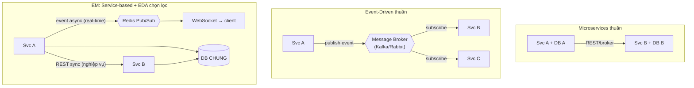

---

### 6B.1 — TẠI SAO KHÔNG MICROSERVICES THUẦN (database-per-service)?

> Lưu ý: em **đã là microservices về mặt deploy** (5 service riêng). Cái em **cố ý chưa làm** là phần khó nhất của microservices thuần: **tách DB + distributed transaction**.

| Lý do không chọn (bây giờ) | Giải thích gắn với hệ thống thật |
|----------------------------|----------------------------------|
| **Coupling chéo chủ yếu nằm ở entity dùng chung** | `user`, `conversation`, `post` được **nhiều service tham chiếu**. Tách DB → mọi lần đọc `User` phải gọi REST sang user-service → đẻ ra **phụ thuộc vòng tròn + chậm**. Em giải bằng `CurrentUserService` đọc `UserRepository` **cục bộ trên DB chung** (xem Mục 8.2) — chỉ làm được vì chung DB. |
| **Phải migrate dữ liệu + mất JOIN** | Tách DB phải chẻ dữ liệu đang nằm chung, mất khả năng `JOIN`/FK xuyên bảng (vd `conversation_members` ↔ `users`) → phải nhân bản dữ liệu hoặc gọi API → rủi ro cao, công sức lớn. |
| **Mất transaction ACID, phải dùng Saga** | Microservices thuần buộc mọi nghiệp vụ xuyên service dùng **Saga + compensating transaction** (rollback thủ công). Với app đồ án, đây là độ phức tạp **chưa đáng** so với lợi ích. |
| **Gánh nặng vận hành nhân lên** | Mỗi DB riêng = thêm backup, monitor, tuning, kết nối. Team nhỏ → chi phí > lợi ích. |

**Ưu / nhược so với Microservices thuần:**

| | Em được (so với MS thuần) | Em mất (so với MS thuần) |
|--|---------------------------|--------------------------|
| Tốc độ tách | **Tách nhanh, không migrate dữ liệu** ✅ | — |
| Đọc dữ liệu chung | **Đọc `User` cục bộ, không round-trip REST** ✅ (nhanh hơn) | — |
| Toàn vẹn dữ liệu | **Vẫn còn transaction ACID + FK trong DB chung** ✅ | — |
| Độc lập dữ liệu | — | **Coupling schema**: đổi bảng `users` ảnh hưởng 4 service ❌ |
| Scale dữ liệu | — | **DB chung là nút thắt** khi scale ❌ |
| Sở hữu theo team | — | Chưa "mỗi team 1 DB" như MS thuần ❌ |

> **Câu chốt:** "Em **đã có** cái lợi của microservices (tách deploy, scale service, cô lập lỗi cấp process) mà **chưa phải trả** cái giá đắt nhất của nó (migrate DB, mất JOIN, Saga). Khi hệ đủ lớn để cần độc lập dữ liệu thật → em tách DB theo bounded context (Bước 6, Mục 17.4). Đây là **Strangler Fig**: tiến hoá dần, không nhảy thẳng vào MS thuần."

---

### 6B.2 — TẠI SAO KHÔNG EVENT-DRIVEN THUẦN (mọi thứ qua broker, bất đồng bộ)?

> Em **có dùng** event-driven — nhưng **chọn lọc** (Redis Pub/Sub cho real-time), **không** lấy EDA làm xương sống cho **toàn bộ** giao tiếp nghiệp vụ.

| Lý do không chọn EDA thuần | Giải thích gắn với hệ thống thật |
|----------------------------|----------------------------------|
| **Nhiều luồng cần KẾT QUẢ NGAY (request–response)** | Client "lấy presigned URL" rồi mới upload được; "tạo post" phải trả về post id để hiển thị. Những cái này **bản chất là đồng bộ** — bắt chúng đi qua event async rồi chờ callback là **làm khó cho dễ**. → Em để **REST đồng bộ** (xem `RemoteMediaStorageAdapter`, Mục 12 Sync/Async). |
| **EDA thuần làm nhất quán dữ liệu khó hơn nhiều** | Mọi thứ eventual consistency → UI phải xử lý trạng thái "đang chờ", khó debug "tại sao chưa thấy". App social cần phần lớn dữ liệu **đọc-thấy-ngay** (read-your-write). |
| **Cần thêm broker bền (Kafka/Rabbit) + vận hành** | EDA thuần cần broker đảm bảo không mất message, có replay, có dead-letter... → hạ tầng nặng. Real-time chat thì **không cần message bền** (offline thì lấy lại từ Mongo) → **Redis Pub/Sub đủ** và nhẹ hơn nhiều (xem Mục 9). |
| **Khó trace/debug khi 100% async** | Một hành động kích hoạt chuỗi event lan tỏa → khó biết "ai gây ra cái gì". Với quy mô đồ án, REST đồng bộ cho **stack-trace dễ lần** hơn. |

**Nhưng em VẪN dùng event-driven ở đúng chỗ nó mạnh:**

| Chỗ dùng event-driven (async) | Vì sao async đúng ở đây | Bằng chứng code |
|-------------------------------|-------------------------|-----------------|
| Đẩy tin nhắn/typing/presence real-time | Fan-out 1→nhiều client, không nên bắt người gửi chờ | `RedisChatSubscriber`, `RedisPubSubConfig` |
| Phát domain event sau khi lưu | Không chặn request gốc; chỉ phát sau commit | `@TransactionalEventListener(AFTER_COMMIT)` (Outbox nhẹ) |
| content → notification | Notify là phụ → fire-and-forget, fail-silent | `RemoteNotificationServiceImpl` (nuốt lỗi) |

**Ưu / nhược so với EDA thuần:**

| | Em được (so với EDA thuần) | Em mất (so với EDA thuần) |
|--|----------------------------|---------------------------|
| Luồng cần kết quả ngay | **Đơn giản, đồng bộ, read-your-write** ✅ | — |
| Debug | **Dễ trace (REST có stack-trace)** ✅ | — |
| Hạ tầng | **Nhẹ (Redis Pub/Sub, không cần Kafka)** ✅ | — |
| Độ bền message | — | Pub/Sub **mất message nếu không ai nghe** (chấp nhận, vì lấy lại từ DB) ❌ |
| Tách rời (decoupling) | — | content **biết** notification tồn tại (gọi REST trực tiếp) → coupling tạm thời ❌ |
| Chịu tải đỉnh (buffer) | — | Không có queue đệm khi peak → khi cần sẽ thêm Kafka (Bước 5) ❌ |

> **Câu chốt:** "Em theo nguyên tắc **'đồng bộ cho cái cần ngay, bất đồng bộ cho cái không cần ngay'**. EDA thuần ép *mọi thứ* bất đồng bộ — lợi cho hệ cực lớn, event-heavy, nhưng **thừa và rủi ro** cho app social mà phần lớn thao tác cần phản hồi tức thì. Em dùng event-driven **đúng liều**: real-time + notify, còn nghiệp vụ chính giữ REST."

---

### 6B.3 — BẢNG SO SÁNH 3 KIẾN TRÚC (1 hình duy nhất để present)

| Tiêu chí | Microservices thuần | Event-Driven thuần (EDA) | **EM: Service-based + EDA chọn lọc** |
|----------|---------------------|--------------------------|----------------------------------------|
| Database | Mỗi service 1 DB | Tùy (thường DB riêng) | **1 DB chung** |
| Giao tiếp nghiệp vụ | REST/gRPC + broker | **Event async (broker)** | **REST đồng bộ** |
| Real-time | Tùy | Có sẵn (event) | **Redis Pub/Sub** ✅ |
| Read-your-write (thấy ngay) | Có | **Khó (eventual)** | **Có** ✅ |
| Nhất quán dữ liệu | Saga/eventual | **Eventual** | **ACID trong DB chung** ✅ |
| Độ trễ mỗi request | Mạng | Mạng + queue | **Mạng (chỉ khi cross-service)** |
| Chịu tải đỉnh (buffer) | Tùy | **Tốt (queue đệm)** ✅ | Chưa (sẽ thêm Kafka) |
| Hạ tầng cần nuôi | Nhiều DB + broker | **Broker bền (Kafka)** | **Redis (nhẹ)** ✅ |
| Độ khó vận hành/debug | Cao | **Cao nhất (async)** | **Trung bình** ✅ |
| Phù hợp khi | Hệ rất lớn, nhiều team | Hệ event-heavy, IoT, log, thanh toán | **App social/chat đang tách dần** ✅ |

> **Một câu để giám khảo nhớ:** "Microservices thuần tối ưu **độc lập**; Event-Driven thuần tối ưu **tách rời + chịu tải bất đồng bộ**; còn em tối ưu **tốc độ tách + sự đơn giản + real-time** — đúng cái một app social/chat ở giai đoạn này cần nhất."

---

### 6B.4 — DẪN CHỨNG THỰC TẾ TRONG CODE (mỗi lựa chọn 1 file để chỉ tay)

| Quyết định kiến trúc | File/bằng chứng | Chỉ ra điều gì |
|----------------------|-----------------|----------------|
| Chung DB (không MS thuần) | `persistence-lib` (entity+repo dùng chung), `CurrentUserService` đọc `UserRepository` cục bộ | Không gọi REST sang user-service → chỉ làm được vì chung DB |
| REST đồng bộ cho nghiệp vụ (không EDA thuần) | `RemoteMediaStorageAdapter`, `RemoteNotificationServiceImpl` (RestClient) | content gọi thẳng media/notification, cần kết quả/đơn giản |
| Event-driven chọn lọc (real-time) | `RedisChatSubscriber`, `RedisPubSubConfig` | Async fan-out tin nhắn qua WebSocket |
| Outbox nhẹ (event sau commit) | `@TransactionalEventListener(AFTER_COMMIT)` | Chỉ phát event khi DB đã chắc chắn lưu |
| Fail-silent (chấp nhận coupling tạm với notify) | `RemoteNotificationServiceImpl` nuốt lỗi `log.warn` | Notify hỏng không làm sập post |

---

### 6B.5 — CÁCH TEST ĐỂ THẤY MẠNH / YẾU CỦA LỰA CHỌN NÀY

> Mục 7.4 đã có 9 test theo *thuộc tính*. Ở đây là **3 thí nghiệm so sánh trực tiếp** chứng minh "tại sao chọn cái này" — mỗi thí nghiệm **đặt kiến trúc của em cạnh phương án kia** để thấy được/mất. Mỗi test ghi rõ **DÙNG CÔNG NGHỆ GÌ** và **LUỒNG TEST từng bước**.

#### Bộ công cụ test dùng chung (cài 1 lần)

| Công cụ | Vai trò trong test | Vì sao chọn |
|---------|--------------------|-------------|
| **k6** (hoặc **JMeter / Postman + Newman**) | Bắn request, đo latency/throughput, viết script kịch bản | k6 viết script bằng JS, nhẹ, ra p95/throughput sẵn |
| **Spring Boot Actuator** (`/actuator/metrics`, `/health`) | Lấy số liệu nội bộ service (thời gian xử lý, health) | Có sẵn trong Spring, bật 1 dòng config |
| **Docker / `docker stop`** | Bật–tắt service để mô phỏng lỗi/đối chứng | Đã đóng gói Docker sẵn (`docker-compose.yml`) |
| **`redis-cli`** (`SUBSCRIBE` / `PUBLISH` / `MONITOR`) | Quan sát & bơm event trực tiếp vào Redis Pub/Sub | Test kênh real-time mà không cần client thật |
| **`mariadb` CLI / DBeaver** | Đổi schema, truy vấn kiểm chứng dữ liệu | Xác nhận trạng thái DB sau test |
| **git** + đếm thủ công | Đo "change amplification" (số service phải sửa) | Bằng chứng định lượng cho coupling |
| **Browser DevTools (tab Network/WS)** | Xem round-trip REST + khung WebSocket phía client | Đo "time-to-visible" cảm nhận thật |

> **Môi trường chuẩn bị (cho cả 3 test):** bật MariaDB (3306), MongoDB (27017), Redis (6379) trên host → `docker compose up --build` → chờ log `CA 5 SERVICE DA KHOI CHAY`. Mở sẵn **log container** + **DevTools** để quan sát.

---

#### TEST A — Sync (REST) vs Async (EDA): đo "thấy ngay" và độ trễ cảm nhận
- **Mục tiêu:** chứng minh vì sao nghiệp vụ chính giữ **REST đồng bộ** thay vì event async.
- **Công nghệ dùng:** **k6** (đo latency + số request) hoặc **Postman** (chạy tay từng bước), **Browser DevTools → tab Network** (đếm round-trip), **Actuator** (đối chiếu thời gian xử lý server).
- **Luồng test (từng bước):**
  1. **Nhánh SYNC (hiện tại):** k6 gọi `POST /posts` → server lưu xong **trả về post id ngay trong 1 response** → ghi mốc thời gian `t_response`.
  2. **Nhánh ASYNC (mô phỏng EDA):** dựng 1 endpoint thử trả `202 Accepted` ngay (chưa lưu), client phải **gọi lại `GET /posts/{id}` lặp (poll) mỗi 200ms** đến khi post xuất hiện → ghi mốc `t_visible`.
  3. So sánh `t_response` (sync) với `t_visible` (async) trên cùng tải, cùng máy.
- **Chỉ số đo:** *time-to-visible* (ms tới lúc client thật sự thấy kết quả), **số round-trip** (sync = 1, async = 1 + N lần poll), p95 latency.
- **Ngưỡng/kết luận:** Sync ~**1 round-trip, thấy ngay**; async tốn **nhiều round-trip + chờ** → chứng minh **chọn sync cho luồng cần-ngay là đúng**.

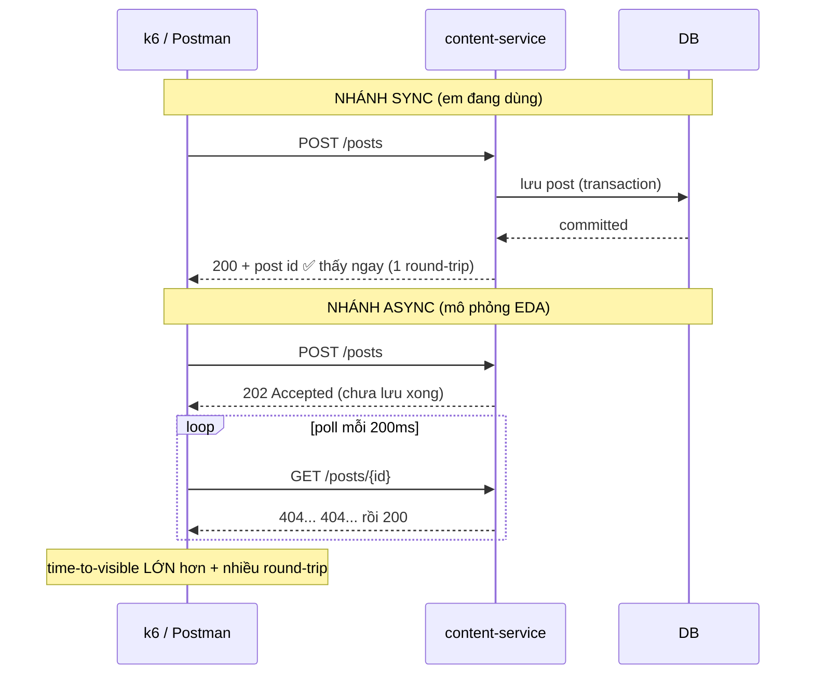

---

#### TEST B — Chung DB vs DB riêng: đo "change amplification" khi đổi schema
- **Mục tiêu:** lộ rõ **điểm yếu** (coupling schema) của lựa chọn chung DB so với MS thuần.
- **Công nghệ dùng:** **`mariadb` CLI / DBeaver** (đổi cột), **Maven** (`mvn -pl <module> compile` để build lại từng service), **git diff / grep** (đếm số service tham chiếu bảng `users`), giấy bút đếm thủ công.
- **Luồng test (từng bước):**
  1. Dùng DBeaver/CLI: thêm/đổi 1 cột trong bảng `users` (vd đổi kiểu `phone`).
  2. Đổi entity tương ứng trong `persistence-lib`.
  3. Chạy `mvn compile`/test cho **từng** service và đánh dấu service nào **gãy build hoặc phải sửa lại** (user-chat, content, notification, ai đều đọc `users` qua `CurrentUserService`).
  4. **Đối chứng (lý thuyết MS thuần):** nếu mỗi service 1 DB, chỉ service **sở hữu** bảng `users` phải sửa → đếm = 1.
- **Chỉ số đo:** *change amplification* = **số service bị ảnh hưởng bởi 1 thay đổi schema**.
- **Ngưỡng/kết luận:** Chung DB → **nhiều service bị ảnh hưởng cùng lúc** → chứng minh **đây là cái giá đã chấp nhận**, và là lý do Bước 6 (tách DB) tồn tại trong lộ trình.

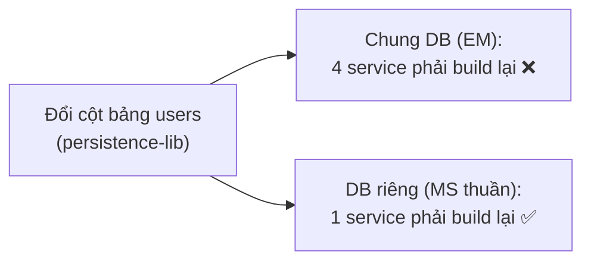

---

#### TEST C — Redis Pub/Sub vs Broker bền (Kafka): test mất message khi consumer chết
- **Mục tiêu:** lộ rõ **điểm yếu** của event-driven chọn lọc (Pub/Sub không bền) so với EDA thuần dùng broker bền.
- **Công nghệ dùng:** **`redis-cli`** (`SUBSCRIBE`, `PUBLISH`, `MONITOR` để quan sát kênh), **`docker stop`** (kill instance đang nghe), **2 trình duyệt** (2 client WebSocket), **MongoDB CLI** (xác nhận tin vẫn còn trong DB để load lại).
- **Luồng test (từng bước):**
  1. Mở `redis-cli` chạy `SUBSCRIBE chat:conversation:{id}` để **nhìn thấy event đang chảy**.
  2. **Tắt consumer:** đóng tab WebSocket của user B (hoặc `docker stop` instance đang giữ session B).
  3. **Phát event lúc đang tắt:** user A gửi 1 tin → server `PUBLISH` lên Redis (nhìn thấy trên `redis-cli`), nhưng **không ai nghe phía B**.
  4. **Bật lại consumer:** mở lại WebSocket của B → kiểm tra B **có** nhận được tin phát lúc tắt qua kênh real-time không (kỳ vọng: **không**).
  5. Kiểm tra Mongo: tin **vẫn nằm trong `messages`** → khi B reconnect, client gọi API load lịch sử → **vẫn thấy tin** (chỉ là không real-time).
  6. **Đối chứng Kafka:** nếu thay bằng Kafka, event nằm trong topic, B bật lại **replay từ offset cũ** → nhận được cả tin phát lúc tắt.
- **Chỉ số đo:** event real-time **có bị mất** khi không ai nghe không; dữ liệu **có mất thật** không (kiểm Mongo).
- **Ngưỡng/kết luận:** Redis Pub/Sub **mất event lúc offline** (đúng thiết kế "fire-and-forget") — **nhưng không mất dữ liệu** vì load lại từ MongoDB. → Chứng minh **Pub/Sub đủ cho real-time**; chỉ khi cần "không bao giờ mất event" (vd notify quan trọng) mới cần Kafka (Bước 5, Mục 17.4).

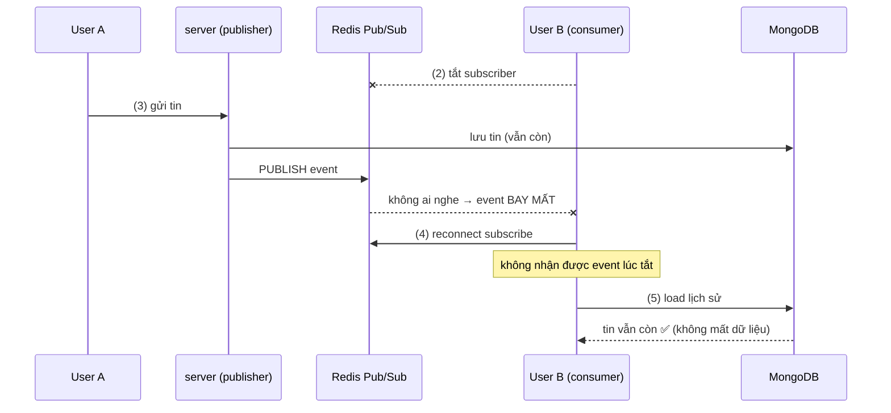

#### Bảng tổng hợp 3 test so sánh

| Test | Công nghệ dùng | So sánh | Chỉ số | Kết luận |
|------|----------------|---------|--------|----------|
| **A** | k6/Postman + DevTools + Actuator | Sync vs Async | time-to-visible, số round-trip | Sync đúng cho luồng cần-ngay |
| **B** | mariadb CLI + Maven + git | Chung DB vs DB riêng | change amplification (số service) | Chung DB là cái giá đã biết → Bước 6 |
| **C** | redis-cli + docker stop + Mongo CLI | Redis Pub/Sub vs Kafka | event mất?/dữ liệu mất? | Pub/Sub đủ cho real-time; Kafka khi cần bền |

> **Câu chốt vàng cho cả mục 6B:** "Em **không** xem Microservices và Event-Driven là thứ phải chọn-một-bỏ-một. Em **lấy phần mạnh của cả hai theo đúng liều**: cấu trúc microservices (tách deploy/scale) + event-driven (real-time), nhưng **giữ DB chung và REST đồng bộ** để tránh hai cái đắt nhất (migrate DB, ép-mọi-thứ-async). Và quan trọng — em **đo được** cả điểm mạnh lẫn điểm yếu của lựa chọn này bằng 3 thí nghiệm so sánh ở trên, nên đây là lựa chọn **có cơ sở**, không phải ngẫu nhiên."

---

<a name="6"></a>
## 7. ARCHITECTURE CHARACTERISTICS (Thuộc tính kiến trúc)

> **Nguyên tắc cốt lõi (phải nói đầu tiên):** Không kiến trúc nào tối đa hoá *mọi* thuộc tính — chọn kiến trúc là **chọn cái nào ưu tiên, cái nào hy sinh**. Kiến trúc service-based của em **cố ý** nâng cao nhóm "dễ phát triển/tiến hoá" và **chấp nhận đánh đổi** nhóm "hiệu năng/nhất quán dữ liệu".

### 7.1 Bảng xếp hạng — cái nào CAO, cái nào THẤP, VÌ SAO

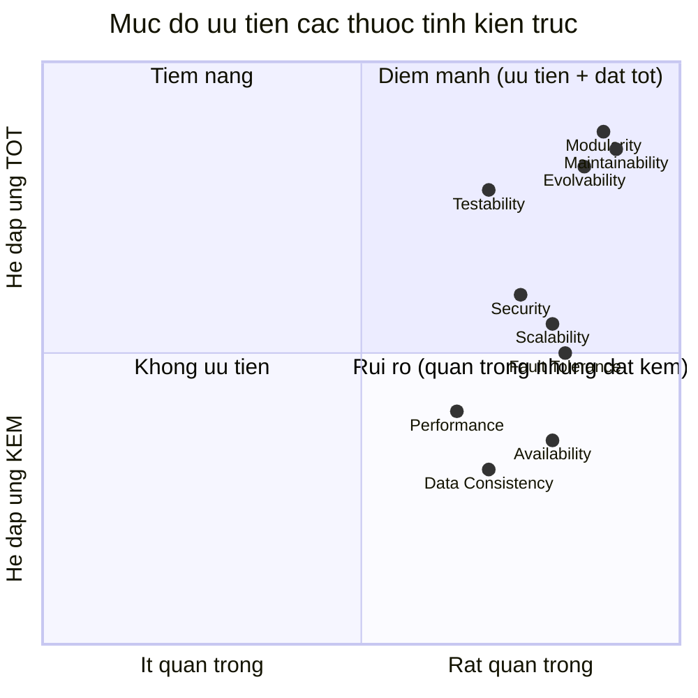

| Thuộc tính | Mức | Vì sao mức đó | Ví dụ tình huống thực tế |
|-----------|:---:|---------------|---------------------------|
| **Maintainability** (bảo trì) | 🟢 CAO | Ranh giới rõ qua Ports & Adapters + Shared Kernel; sửa 1 service ít ảnh hưởng service khác | Sếp yêu cầu đổi cách đặt tên file ảnh khi upload → em chỉ sửa **media-service** và deploy lại mình nó, 4 service kia không cần đụng tới. |
| **Modularity** (mô-đun) | 🟢 CAO | Tách 5 service theo cụm coupling đo thật; mỗi service 1 JAR | 2 bạn trong nhóm: 1 người làm tính năng story (content-service), 1 người làm thông báo (notification-service) → code 2 repo riêng, **gần như không đụng nhau**, ít conflict khi merge. |
| **Evolvability** (tiến hoá) | 🟢 CAO | Strangler Fig tách dần; đổi adapter (S3→remote) không sửa business | Công ty muốn bỏ AWS S3 (đắt) chuyển sang **MinIO tự host** → em chỉ viết 1 adapter lưu trữ mới, tính năng đăng bài/gửi ảnh **chạy y nguyên, không sửa**. |
| **Testability** (kiểm thử) | 🟢 CAO | Business phụ thuộc interface → mock dễ; service nhỏ → test nhanh | Test tính năng "đăng bài" ngay trên máy laptop **không có internet, không có tài khoản AWS** → vẫn chạy được vì media được "giả lập" (mock cổng). |
| **Scalability** (mở rộng) | 🟡 TRUNG BÌNH | Tách service cho phép scale riêng, NHƯNG **chung DB** + **1 container** giới hạn lại | Đợt sự kiện nhiều người upload ảnh, em nhân 3 bản media-service để chịu tải → upload nhanh hơn, **nhưng** tới lúc mọi service cùng ghi vào 1 DB thì DB thành nút thắt, không nhanh thêm được. |
| **Fault Tolerance** (chịu lỗi) | 🟡 TRUNG BÌNH | Có graceful degradation (nuốt lỗi notify), NHƯNG 1 container fail-fast → 1 chết là 5 chết | Dịch vụ gửi thông báo bị lỗi → người dùng **vẫn đăng bài, vẫn chat bình thường**, chỉ là bạn bè không nhận được thông báo. **Nhưng** nếu container hết RAM thì cả 5 dịch vụ tắt cùng lúc. |
| **Security** (bảo mật) | 🟡 TRUNG BÌNH | Có JWT/Cognito + rate-limit, NHƯNG REST nội bộ `/internal/*` chưa xác thực giữa service | Kẻ xấu dò mật khẩu: sai 5 lần là **bị khoá 15 phút** ngay. **Nhưng** nếu kẻ xấu chui được vào mạng nội bộ, hắn có thể gọi thẳng API nội bộ tạo thông báo giả vì chưa kiểm tra danh tính giữa các service. |
| **Performance** (hiệu năng) | 🔴 THẤP (đánh đổi) | Cross-service REST thêm độ trễ mạng so với monolith gọi hàm in-process | Người dùng bấm "đăng bài kèm ảnh": content-service phải **gọi qua mạng** sang media-service rồi mới lưu → chậm hơn vài chục–vài trăm mili-giây so với hồi còn monolith gọi hàm trực tiếp. |
| **Data Consistency** (nhất quán) | 🔴 THẤP (đánh đổi) | Không có transaction xuyên service → eventual consistency | Đăng bài **thành công** (đã lưu), nhưng đúng lúc đó dịch vụ thông báo lỗi → bài đã hiện trên tường mà **bạn bè không nhận được thông báo** "có bài mới". Hai việc không "cùng thành công hoặc cùng huỷ" như trong 1 giao dịch. |
| **Availability** (sẵn sàng) | 🔴 THẤP (hiện tại) | 1 container → mọi service chết cùng nhau; chưa có HA/redundancy; chưa runtime-test | Dịch vụ chat ngốn RAM làm **cả container sập** → kéo theo media, AI, content, notification **tắt theo**, người dùng không vào được app dù lỗi chỉ ở 1 phần. |

> **Câu chốt để present:** "Em ưu tiên **Maintainability, Modularity, Evolvability** vì mục tiêu của dự án là **tách monolith để dễ phát triển và tiến hoá**. Đổi lại, em **chấp nhận hy sinh Performance và Data Consistency** (do cross-service REST + chung DB), và **Availability hiện tại còn thấp** do đóng gói 1 container — đây là hạn chế triển khai, không phải hạn chế thiết kế."

### 7.2 TẠI SAO nhóm này được đánh giá CAO?

| Thuộc tính cao | Lý do gốc (từ quyết định kiến trúc) |
|----------------|--------------------------------------|
| **Maintainability** | Vì dùng **Ports & Adapters** → nghiệp vụ không dính hạ tầng; vì **Shared Kernel** → contract tập trung 1 chỗ, sửa 1 lần. Đây chính là **mục đích** của việc tách monolith. |
| **Modularity** | Vì **đo coupling thật** rồi gom cụm (`chat↔conversation`, `post↔notification`), không tách bừa → ranh giới service "tự nhiên", ít rò rỉ. |
| **Evolvability** | Vì **Strangler Fig**: có thể thay/tách từng phần mà hệ vẫn chạy; vì property `media.mode` → đổi local↔remote runtime. |
| **Testability** | Hệ quả của Maintainability: phụ thuộc interface → mock được; service nhỏ → unit/integration test gọn. |

### 7.3 TẠI SAO nhóm còn lại bị đánh giá THẤP?

| Thuộc tính thấp | Lý do gốc (đánh đổi có chủ đích) |
|-----------------|----------------------------------|
| **Performance** | Mỗi cross-service call biến lời gọi hàm (µs) thành lời gọi mạng (ms). Đây là **cái giá cố hữu** của microservices — nhanh hơn monolith là điều **không** mong đợi ở từng request. |
| **Data Consistency** | Chọn **không** dùng transaction phân tán (phức tạp) → chấp nhận eventual consistency. Notify fail không rollback post. |
| **Availability** | Đóng gói **1 container** (cho dev/demo đơn giản) → mất tính redundancy. Chưa runtime-test, chưa có nhiều instance. |
| **Security (nội bộ)** | REST `/internal/*` hiện **tin tưởng mạng nội bộ**, chưa có mTLS/token giữa service → ưu tiên làm sau (Stage 2 PLAN.md đã ghi nhận). |

---

### 7.4 KỊCH BẢN TEST CHI TIẾT — làm sao biết thuộc tính có "hợp lý" hay không?

> Mỗi thuộc tính đều có **cách đo khách quan**. Dưới đây là kịch bản test cụ thể: **công cụ → các bước → chỉ số đo → ngưỡng đạt/không đạt**. Đây là phần ăn điểm khi giám khảo hỏi "làm sao chứng minh?".

#### TEST 1 — Performance (đo độ trễ & throughput)
- **Công cụ:** **k6** / **JMeter** / **Gatling** (load test) + Spring Boot Actuator (`/actuator/metrics`).
- **Kịch bản:**
  1. Khởi động đủ 5 service + DB/Redis/Mongo.
  2. Dùng k6 bắn **500 user ảo** gọi API "đăng bài có ảnh" (đi qua content→media REST) trong 5 phút.
  3. Đồng thời đo 1 API **không** cross-service (vd đọc profile) làm đối chứng.
- **Chỉ số:** p95 latency (ms), throughput (req/s), error rate (%).
- **Ngưỡng đạt:** p95 < 500ms cho API cross-service; error rate < 1%.
- **Kết luận rút ra:** Nếu API cross-service chậm hơn API in-process nhiều lần → chứng minh **đánh đổi Performance** là có thật → cần Bước 3 (Resilience) + Bước 5 (Queue) ở mục 17.4.

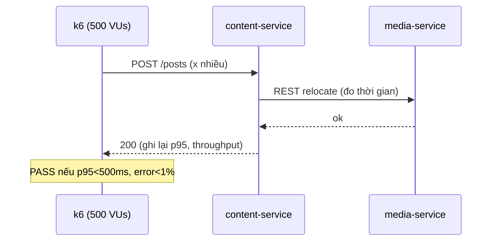

#### TEST 2 — Scalability (đo khả năng mở rộng)
- **Công cụ:** k6 (tăng tải dần) + Docker/K8s (nhân bản instance) + Prometheus/Grafana.
- **Kịch bản:**
  1. Chạy **1 instance** `media-service`, bắn tải tăng dần đến khi throughput bão hoà → ghi lại "trần".
  2. Chạy **2, 3 instance** sau load balancer, lặp lại.
  3. Vẽ đồ thị throughput theo số instance.
- **Chỉ số:** throughput tối đa theo số instance; có **tuyến tính** không (scale linearly).
- **Ngưỡng đạt:** Thêm instance → throughput tăng gần tuyến tính (vd 2 instance ≈ 1.8x).
- **Điểm quan trọng:** Test này sẽ **lộ ra giới hạn chung DB** — khi scale service nhưng DB là điểm nghẽn, throughput **không tăng** dù thêm instance → chứng minh tại sao Scalability chỉ ở mức **TRUNG BÌNH**.

#### TEST 3 — Fault Tolerance (chaos test — kiểm tra cô lập lỗi)
- **Công cụ:** thủ công (`docker stop`) hoặc **Chaos Monkey / Toxiproxy** (giả lập lỗi mạng).
- **Kịch bản A (graceful degradation):**
  1. Tắt `notification-service` (8084).
  2. Gọi API "đăng bài" trên `content-service`.
  3. **Kỳ vọng:** đăng bài vẫn **thành công** (200), chỉ thiếu notification, log có warn.
  - **PASS** nếu post vẫn thành công → chứng minh `RemoteNotificationServiceImpl` nuốt lỗi đúng.
- **Kịch bản B (độ trễ mạng):**
  1. Dùng Toxiproxy thêm **độ trễ 5s** vào media-service.
  2. Gọi "đăng bài có ảnh".
  3. **Kỳ vọng (hiện tại):** request bị **treo 5s** (vì chưa có timeout) → **FAIL** → chứng minh cần Resilience4j (Bước 3).
- **Chỉ số:** % nghiệp vụ chính vẫn chạy khi 1 service phụ chết.

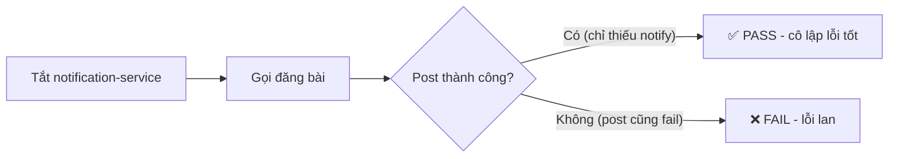

#### TEST 4 — Availability (đo độ sẵn sàng)
- **Công cụ:** **Uptime monitor** (vd UptimeRobot / Prometheus blackbox exporter) ping `/actuator/health`.
- **Kịch bản:**
  1. Theo dõi health check mỗi 10s trong 24h.
  2. Chủ động `docker stop` 1 service, đo thời gian phát hiện + phục hồi.
- **Chỉ số:** uptime % (vd 99.9%), MTTR (thời gian phục hồi trung bình).
- **Phát hiện quan trọng:** Vì **1 container fail-fast**, tắt 1 service làm **cả 5 health check đỏ** → chứng minh Availability **THẤP** ở triển khai hiện tại → cần Bước 1 (tách container + K8s tự restart).

#### TEST 5 — Data Consistency (kiểm tra nhất quán)
- **Công cụ:** test tích hợp (JUnit + Testcontainers) hoặc thủ công + truy vấn DB.
- **Kịch bản:**
  1. Giả lập `notification-service` lỗi giữa chừng.
  2. Đăng bài → kiểm tra: **Post có trong MariaDB** nhưng **notification KHÔNG có trong Mongo**.
  3. Xác nhận hệ ở trạng thái **không nhất quán tạm thời**.
- **Ngưỡng "chấp nhận được":** dữ liệu **eventually consistent** (notify có thể retry sau), không mất dữ liệu lõi (post).
- **Kết luận:** Chứng minh cần **Outbox + Message Queue** (Bước 5) nếu muốn notify "không bao giờ mất".

#### TEST 6 — Maintainability / Modularity (đo bằng kiến trúc, không cảm tính)
- **Công cụ:** **ArchUnit** (test ràng buộc kiến trúc bằng code), **SonarQube** (code smell, cyclomatic complexity), git history.
- **Kịch bản:**
  1. Viết **ArchUnit test**: "business KHÔNG được import trực tiếp `S3Service`, chỉ được dùng `MediaStoragePort`" → chạy CI, nếu ai vi phạm → **build fail**.
  2. Đo **"change amplification"**: chọn 1 yêu cầu thay đổi (vd thêm field vào post) → đếm **số file/service phải sửa**. Càng ít càng tốt.
  3. SonarQube đo độ phức tạp & coupling.
- **Ngưỡng đạt:** ArchUnit pass (không rò rỉ boundary); 1 thay đổi nghiệp vụ chỉ chạm **1 service**.
- **Đây là bằng chứng định lượng** cho việc Maintainability được đánh giá CAO.

```java
// Ví dụ ArchUnit test (minh hoạ) — chạy trong CI
@ArchTest
static final ArchRule business_khong_dung_S3_truc_tiep =
    noClasses().that().resideInAPackage("..modules.post..")
        .should().dependOnClassesThat().haveSimpleName("S3Service");
// FAIL build nếu PostService lén gọi thẳng S3 thay vì qua MediaStoragePort
```

#### TEST 7 — Testability (đo khả năng kiểm thử)
- **Công cụ:** **JaCoCo** (code coverage), JUnit + Mockito.
- **Kịch bản:** Viết unit test cho `PostServiceImpl` bằng cách **mock `MediaStoragePort`** (không cần S3 thật) và **mock `NotificationService`**.
- **Chỉ số:** coverage %; thời gian chạy test.
- **Ngưỡng đạt:** test chạy **không cần hạ tầng ngoài** (S3/network) → chứng minh thiết kế interface giúp Testability CAO.

#### TEST 8 — Security (kiểm thử bảo mật)
- **Công cụ:** **OWASP ZAP** (quét lỗ hổng), test thủ công + Postman.
- **Kịch bản:**
  1. Gọi API nghiệp vụ **không kèm JWT** → kỳ vọng **401**.
  2. Gọi đăng nhập **sai 5 lần liên tiếp** → kỳ vọng bị **khoá (rate-limit)** → kiểm tra `RateLimitService`.
  3. Gọi thẳng endpoint nội bộ `/internal/notifications` từ ngoài → **phát hiện rủi ro** (hiện chưa chặn) → đề xuất mTLS/network policy.
- **Ngưỡng đạt:** API nghiệp vụ chặn request thiếu/sai JWT; rate-limit hoạt động; **ghi nhận** endpoint internal cần bảo vệ thêm.

#### TEST 9 — Evolvability (kiểm tra khả năng tiến hoá)
- **Kịch bản:** Viết **adapter mới** (vd `MinioMediaStorageAdapter`) cắm vào `MediaStoragePort`, đổi cấu hình để dùng nó, chạy lại test nghiệp vụ.
- **Ngưỡng đạt:** **Không phải sửa 1 dòng** trong `PostServiceImpl`/`MessageCommandService` → chứng minh Evolvability CAO (đúng tinh thần Hexagonal).

### 7.5 Bảng tổng hợp TEST (để present nhanh)

| Thuộc tính | Công cụ test | Chỉ số | Ngưỡng đạt |
|-----------|--------------|--------|------------|
| Performance | k6/JMeter | p95 latency, throughput | p95 < 500ms, error < 1% |
| Scalability | k6 + nhân instance | throughput/instance | tăng gần tuyến tính |
| Fault Tolerance | docker stop / Toxiproxy | % nghiệp vụ còn sống | post OK khi notify chết |
| Availability | health monitor | uptime %, MTTR | ≥ 99.9% (sau khi tách container) |
| Data Consistency | Testcontainers | trạng thái sau lỗi | eventually consistent, không mất post |
| Maintainability | ArchUnit + SonarQube | vi phạm boundary, change amplification | 0 vi phạm, 1 thay đổi = 1 service |
| Testability | JaCoCo + Mockito | coverage, độc lập hạ tầng | test chạy không cần S3 thật |
| Security | OWASP ZAP + Postman | lỗ hổng, chặn 401, rate-limit | chặn thiếu JWT, khoá sau 5 lần sai |
| Evolvability | thêm adapter mới | số dòng business phải sửa | 0 dòng |

> **Câu chốt vàng:** "Em không chỉ *tuyên bố* hệ có Maintainability cao — em **chứng minh bằng ArchUnit test trong CI** (vi phạm boundary là build fail) và bằng *change amplification* (1 thay đổi chỉ chạm 1 service). Ngược lại, em cũng **đo ra** Performance và Availability đang là điểm yếu qua load test (k6) và chaos test (docker stop) — và chính các con số đó định hướng lộ trình phát triển ở Mục 17."

---

<a name="7"></a>
## 8. DESIGN PATTERNS ĐANG DÙNG

Đây là phần **ăn điểm nhất** của project — nhiều pattern kiến trúc thật:

| Pattern | Nơi áp dụng | Mục đích |
|---------|-------------|----------|
| **Strangler Fig** | `PLAN.md` — tách monolith dần theo stage | Migrate an toàn, không big-bang |
| **Ports & Adapters (Hexagonal)** | `MediaStoragePort` + `S3MediaStorageAdapter` / `RemoteMediaStorageAdapter` | Business không phụ thuộc hạ tầng (S3/REST) |
| **Shared Kernel (DDD)** | `common-lib`, `persistence-lib`, `common-core` | Chia sẻ contract/entity/infra giữa service |
| **Consumer-Driven Narrow Interface** | `NotificationService` interface, REST `/internal/*` hẹp | Service chỉ expose đúng cái cần |
| **Adapter / Gateway** | `RemoteMediaStorageAdapter`, `RemoteNotificationServiceImpl`, `RemoteBlockUserServiceImpl` | Bọc gọi REST liên service |
| **Graceful Degradation / Fail-silent** | `RemoteNotificationServiceImpl` nuốt lỗi (log.warn) | Notify optional → không làm sập nghiệp vụ chính |
| **CQRS** | `MessageCommandService` / `MessageQueryService` | Tách đọc/ghi |
| **Publish–Subscribe** | `RedisChatSubscriber` ← Redis Pub/Sub | Đẩy real-time decouple |
| **Repository** | `UserRepository`, `MessageRepository`... (persistence-lib) | Trừu tượng truy cập DB |
| **DTO + Mapper** | MapStruct mappers | Tách entity khỏi response |
| **Singleton (Spring Bean)** | mọi `@Service/@Component` | Spring IoC quản lý |

### 8.1 Hình minh hoạ Ports & Adapters (pattern lõi)

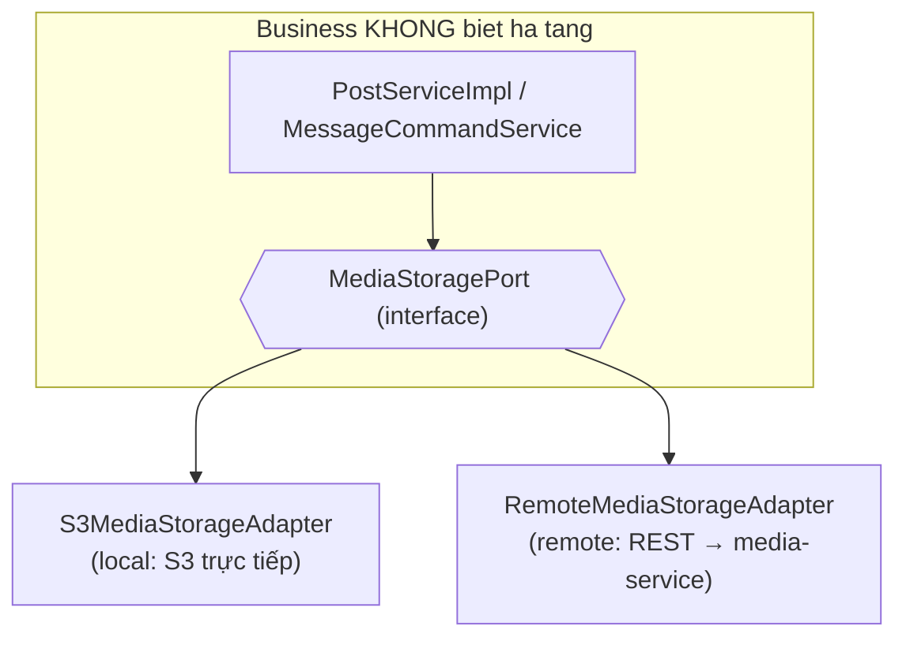

> **Khoe điểm này:** "Em không hard-code S3 vào nghiệp vụ. Nghiệp vụ chỉ gọi `MediaStoragePort`. Muốn chạy monolith → cắm `S3MediaStorageAdapter`; muốn tách microservice → cắm `RemoteMediaStorageAdapter` gọi media-service qua REST. **Đổi adapter, không đổi business** — đó chính là Hexagonal Architecture."

### 8.2 Hình minh hoạ giải coupling user (không gọi REST vòng tròn)

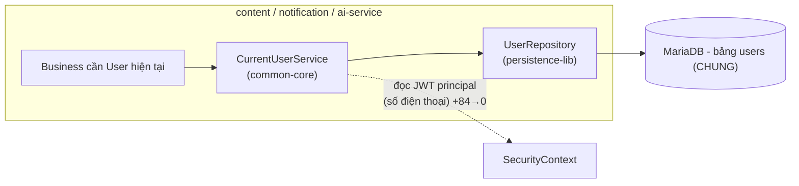

> "Vì user là core được mọi service tham chiếu, nếu service nào cũng gọi REST sang user-service sẽ tạo **phụ thuộc vòng tròn + chậm**. Em giải bằng `CurrentUserService`: đọc principal từ JWT rồi truy `UserRepository` **cục bộ trên DB chung** → không cần REST. Đây là hệ quả của lựa chọn **chung DB**."

---

<a name="8"></a>
## 9. TẠI SAO DÙNG REDIS?

Redis (cấu hình trong `common-core`) đóng **nhiều vai trò**:

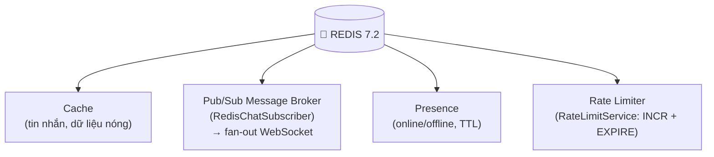

| Vai trò | Vì sao Redis hợp lý |
|---------|---------------------|
| **Cache** | Đọc từ RAM nhanh hơn DB ~10–100 lần; chat là read-heavy. |
| **Message Broker (Pub/Sub)** | Đẩy event real-time giữa các instance với độ trễ cực thấp; tin nhắn nếu offline lấy lại từ Mongo nên **không cần message bền**. |
| **Presence** | Key có **TTL tự hết hạn** → user ngừng refresh là tự offline, không cần cron quét DB. |
| **Rate Limiter** | `INCR` atomic + `EXPIRE`, **chia sẻ trạng thái giữa nhiều instance** (bộ đếm in-memory cục bộ sẽ vô dụng khi scale). |

### So sánh Redis Pub/Sub vs Kafka/RabbitMQ (khi nào nên/không nên)

| | **Redis Pub/Sub (em dùng)** | Kafka | RabbitMQ |
|--|----------------------------|-------|----------|
| Độ trễ | **Cực thấp** ✅ | Thấp | Thấp |
| Lưu message | **Không (fire-and-forget)** | Có (bền, replay) ✅ | Có (queue) |
| Phù hợp | **Real-time notify (chat/typing/presence)** ✅ | Event sourcing, log, analytics | Task queue, công việc nền |
| Phức tạp | **Thấp** ✅ | Cao | Trung bình |

> **Nên Redis Pub/Sub:** real-time, không cần đảm bảo không mất message (mất thì lấy lại từ DB).
> **KHÔNG nên Redis Pub/Sub:** khi **bắt buộc không được mất** message hoặc cần **replay lịch sử** → dùng Kafka.

---

<a name="9"></a>
## 10. CQRS — TẠI SAO, CÓ HỢP LÝ KHÔNG

### 10.1 CQRS trong hệ thống

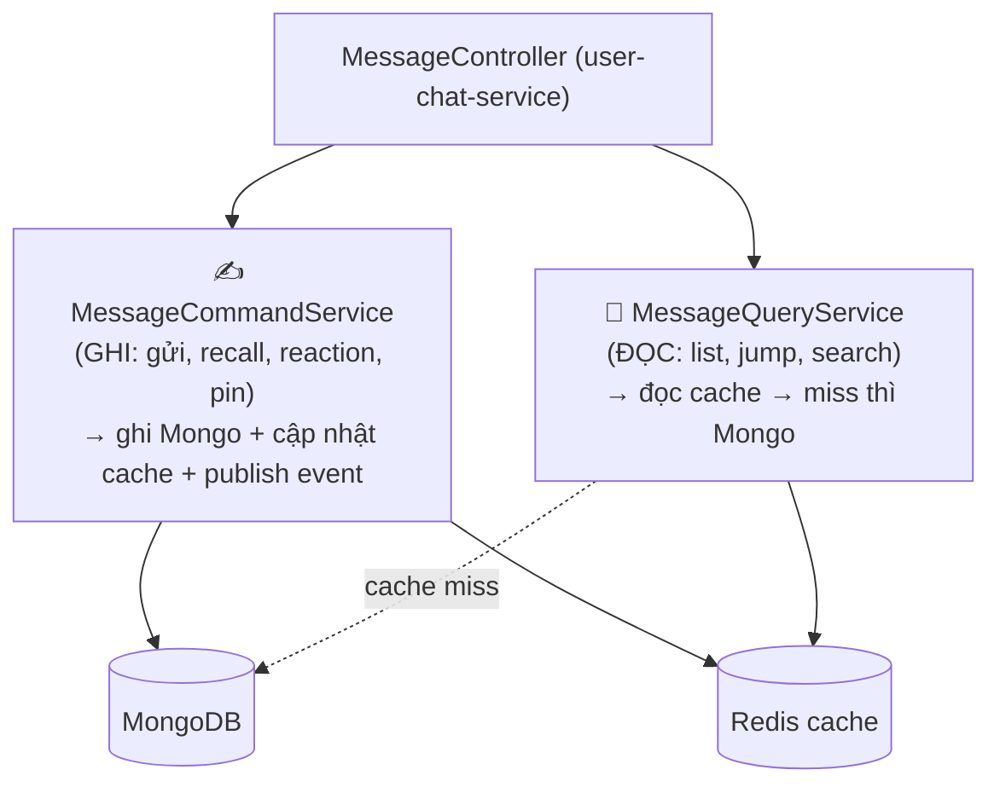

### 10.2 Tại sao CQRS? Có hợp lý không?

| Lý do | Giải thích |
|-------|-----------|
| Đường ghi nhiều side-effect | Ghi = lưu Mongo + cập nhật cache + publish event real-time. |
| Đường đọc tối ưu cache | Đọc = ưu tiên cache Redis, miss mới xuống Mongo, phân trang cursor. |
| Chat là read-heavy | Đọc tin >> gửi tin → tách để tối ưu/scale đường đọc riêng. |

✅ **Hợp lý** vì hai đường thật sự khác nhau. ⚠️ Nhưng phải nói rõ: đây là **CQRS "nhẹ" — cùng 1 database**, KHÔNG phải CQRS full với 2 DB (read model riêng + đồng bộ). Với quy mô này, CQRS nhẹ là **đủ và đúng**; full-blown sẽ phức tạp thừa.

### 10.3 So sánh

| | CRUD 1 service | **CQRS nhẹ (em dùng)** | CQRS + 2 DB |
|--|----------------|------------------------|-------------|
| Tối ưu đọc/ghi riêng | Khó | **Có** ✅ | Tối đa |
| Phức tạp | Thấp | **Vừa** | Cao |
| Nên dùng khi | CRUD đơn giản | **Read-heavy + có cache** ✅ | Đọc/ghi lệch cực mạnh, hệ rất lớn |

---

<a name="10"></a>
## 11. EVENT SOURCING — BẠN CÓ HAY KHÔNG? (RẤT QUAN TRỌNG)

> ⚠️ **Đề có hỏi Event Sourcing — đừng trả lời nhầm.** Hệ thống của em dùng **Event-Driven (Pub/Sub)** chứ **KHÔNG phải Event Sourcing**.

```mermaid
graph TB
    subgraph ED["Event-Driven Pub/Sub - EM CO"]
        E1["Event = thông báo tức thời"]
        E2["Phát đi rồi thôi (fire-and-forget)"]
        E3["KHÔNG lưu event lại"]
        E4["State thật ở MariaDB/MongoDB"]
    end
    subgraph ES["Event Sourcing - EM KHONG CO"]
        S1["Event = nguồn chân lý duy nhất"]
        S2["Lưu TOÀN BỘ event (append-only log)"]
        S3["State = replay lại các event"]
        S4["Dùng cho audit / khôi phục lịch sử"]
    end
```

| Tiêu chí | **Event-Driven (em CÓ)** | Event Sourcing (em KHÔNG có) |
|----------|--------------------------|------------------------------|
| Mục đích event | Notify real-time | Lưu trữ chính của state |
| Lưu event? | Không (Pub/Sub bay qua) | Có, vĩnh viễn |
| Khôi phục state | Đọc DB | Replay toàn bộ event |
| Bằng chứng | `RedisChatSubscriber` đẩy WebSocket rồi quên | (không có event store) |

### Câu trả lời mẫu khi bị hỏi "có Event Sourcing không?"
> "Không ạ. Em dùng **Event-Driven Architecture (Redis Pub/Sub)**: khi có hành động (gửi tin, post, reaction), em publish một domain event để đẩy real-time qua WebSocket. Nhưng event này **nhất thời, không lưu lại** — state thật nằm ở MariaDB/MongoDB. Event Sourcing thì lưu **toàn bộ chuỗi event** làm nguồn chân lý và dựng lại state bằng replay; chat/social không cần mức đó nên em không dùng (tránh phức tạp về event store, snapshot, versioning)."

### Khi nào NÊN / KHÔNG NÊN Event Sourcing
- ✅ **NÊN:** tài chính, kế toán, kho — cần lịch sử bất biến + audit + tua lại trạng thái.
- ❌ **KHÔNG NÊN (case em):** social/chat — chỉ cần state hiện tại; ES gây phức tạp & tốn kém.

### Điểm "cận" có thể khoe thêm
- `@TransactionalEventListener(AFTER_COMMIT)`: event chỉ phát **sau khi DB commit** → giống **Transactional Outbox (nhẹ)**, không phát event cho dữ liệu chưa lưu.

---

<a name="11"></a>
## 12. SYNC vs ASYNC — DÙNG CẢ HAI Ở ĐÂU

| Vị trí | Kiểu | Vì sao |
|--------|------|--------|
| Client → service (REST API) | **SYNC** | User cần biết kết quả ngay |
| Ghi DB (MariaDB/Mongo) | **SYNC** (transaction) | Phải chắc chắn đã lưu |
| content-service → notification-service | **REST + fail-silent** | Notify optional, lỗi không làm sập post |
| business → media-service (presigned URL) | **SYNC REST** (qua adapter) | Cần URL trả về để client upload |
| Publish event real-time | **ASYNC** (`@TransactionalEventListener AFTER_COMMIT`) | Không chặn request gốc |
| Redis Pub/Sub → WebSocket | **ASYNC fan-out** | Đẩy tới nhiều client |

```mermaid
sequenceDiagram
    participant C as Client
    participant S as Service
    participant DB as DB
    participant R as Redis/WebSocket
    C->>S: REST (SYNC - chờ)
    S->>DB: lưu (SYNC - transaction)
    DB-->>S: committed
    S-->>C: 200 OK (SYNC)
    Note over S,R: sau commit
    S-)R: publish event (ASYNC - không chờ)
    R-)C: WebSocket push (ASYNC)
```

### Ví dụ so sánh nên/không nên
- **Nên SYNC:** "tạo post", "lấy presigned URL" — cần kết quả ngay.
- **Nên ASYNC:** "gửi notification", "đẩy tin real-time" — không nên bắt user chờ; lỗi cũng không nên làm hỏng nghiệp vụ chính.
- **Case em:** lưu dữ liệu = sync; notify + real-time = async/fail-silent → **đúng nguyên tắc**.

⚠️ **Trade-off cross-service REST:** mỗi call REST thêm độ trễ mạng + cần xử lý lỗi (đã làm bằng `MediaUnavailableException` + nuốt lỗi notify). Hướng cải tiến: timeout + retry + circuit-breaker (Resilience4j).

---

<a name="11b"></a>
## 12B. CÁC KỸ THUẬT KHÁC (cho dấu "..." sau Sync/Async trong đề)

> Đề ghi "Sync/Async**...**" — dấu ba chấm ngụ ý có thể hỏi thêm kỹ thuật khác. Đây là các kỹ thuật **thật sự có trong code**, gom 1 chỗ để trả lời nhanh.

| Kỹ thuật | Là gì / dùng ở đâu | Bằng chứng / ví dụ thực tế |
|----------|--------------------|----------------------------|
| **Caching (Cache-Aside)** | Đọc cache Redis trước, miss mới xuống DB rồi nạp lại cache | Đọc danh sách tin nhắn: lấy từ Redis, không có mới query Mongo |
| **Cursor-based Pagination** | Phân trang theo mốc thời gian/ID thay vì OFFSET | Cuộn tin nhắn cũ / newsfeed: dùng cursor (`createdAt`/`id`), tránh OFFSET lớn gây chậm |
| **Idempotency (chống xử lý trùng)** | Mỗi tin nhắn có `client_message_id` **unique index** | Mạng chập chờn, client **gửi lại** cùng tin → DB từ chối bản trùng → **không bị double tin nhắn** |
| **Rate Limiting** | Redis `INCR` + `EXPIRE` + key khoá | Sai mật khẩu 5 lần → khoá 15 phút; chống brute-force/spam OTP |
| **Real-time push (WebSocket/STOMP)** | Server đẩy thay vì client hỏi liên tục (polling) | Tin nhắn/typing/presence hiện tức thì qua `/topic/...` |
| **Presence bằng TTL** | Key Redis tự hết hạn khi client ngừng refresh | Tự chuyển user sang offline mà không cần cron quét DB |
| **Transactional Outbox (nhẹ)** | `@TransactionalEventListener(AFTER_COMMIT)` | Chỉ phát event real-time **sau khi DB commit** → không đẩy dữ liệu chưa lưu |
| **Pub/Sub fan-out** | Redis Pub/Sub phát 1 lần, nhiều subscriber nhận | Đẩy 1 tin tới mọi thành viên hội thoại |
| **Feed Ranking (xếp hạng newsfeed)** | Tính `rankingTime` = thời gian + điểm thưởng theo react/comment, **giảm dần theo độ tuổi bài** | `Post.recalculateRankingTime()`: bài nhiều tương tác + mới → lên top; bài cũ tự tụt |
| **Optimistic UI hỗ trợ** | `client_message_id` cho phép client hiển thị tin ngay rồi đối chiếu khi server xác nhận | gửi tin "mượt" không chờ round-trip |
| **DTO + Mapper (MapStruct)** | Map entity↔DTO lúc compile (không reflection) | nhanh + tách entity khỏi response API |
| **Polyglot Persistence** | Dùng đúng DB cho đúng loại dữ liệu | MariaDB (quan hệ) + MongoDB (tài liệu) — xem Mục 3B |
| **Soft delete / xoá 1 phía** | Đánh dấu `deletedFor` thay vì xoá thật | "Xoá ở phía tôi" — người kia vẫn thấy tin |

> **Sẽ làm thêm (nói khi bị hỏi):** **Saga** (giao dịch xuyên service), **Circuit Breaker** (Resilience4j), **CDC/Debezium** (đồng bộ khi tách DB) — xem lộ trình Mục 17.4.

> **Câu ăn điểm về Idempotency:** "Em xử lý trùng tin nhắn bằng `client_message_id` có **unique index** trong MongoDB: client tự sinh ID cho mỗi tin, nếu mạng lỗi và gửi lại thì DB chặn bản trùng — đảm bảo **gửi đúng 1 lần (exactly-once ở tầng dữ liệu)** dù client retry nhiều lần."

---

<a name="12"></a>
## 13. LÀM THẾ NÀO ĐỂ TĂNG PERFORMANCE?

### 13.1 Đã làm

| Kỹ thuật | Cách làm | Lợi ích |
|----------|----------|---------|
| **Cache Redis** | Cache dữ liệu nóng (tin nhắn) | Giảm tải DB, đọc nhanh |
| **CQRS + cursor pagination** | Đọc cache trước, phân trang theo timestamp | Không chậm khi cuộn sâu |
| **Pub/Sub thay polling** | Server push qua WebSocket | Giảm tải mạng/CPU |
| **Async sau commit** | Event đẩy ngoài luồng request | Request trả nhanh |
| **MapStruct** | Mapping compile-time (không reflection) | Nhanh hơn mapping runtime |
| **media-service stateless** | Tách riêng, scale ngang dễ | Chịu tải upload tốt |
| **Boot tuần tự (start-all.sh)** | Tránh 5 JVM boot cùng lúc | Không OOM/exit 137 |

### 13.2 Cải tiến thêm (nói khi bị hỏi "tăng nữa thế nào")

```mermaid
graph TB
    P["TĂNG PERFORMANCE THÊM"]
    P --> A["1. Connection pool + timeout cho RestClient"]
    P --> B["2. Circuit breaker (Resilience4j)<br/>cho cross-service"]
    P --> C["3. Index DB đúng<br/>(conversationId+createdAt...)"]
    P --> D["4. Tách container/scale riêng<br/>service nặng (ai, user-chat)"]
    P --> E["5. Redis pipeline/batch"]
    P --> F["6. CDN cho media tĩnh"]
    P --> G["7. Async REST (bất đồng bộ hoá<br/>các call không cần kết quả ngay)"]
```

1. **Tách container & scale riêng:** hiện 5 service chạy chung 1 container — khi tải cao nên **tách ra nhiều container/pod**, scale riêng service nóng.
2. **Circuit breaker + timeout** cho RestClient (tránh 1 service chậm kéo cả chuỗi).
3. **Index DB** hợp lý cho truy vấn nóng.
4. **Redis pipeline**, **CDN media**, **nén WebSocket**.

---

<a name="13"></a>
## 14. DEVOPS

| Khía cạnh | Hiện trạng / Đề xuất |
|-----------|---------------------|
| **Containerization** | **Docker multi-stage** (`Dockerfile`): build 3 lib → 5 service → 1 image |
| **Orchestration** | `docker-compose.yml`: 1 container chạy cả 5 service (8081–8085) |
| **Bootstrap** | `start-all.sh`: khởi động **tuần tự** (nhẹ→nặng), chờ port sẵn sàng + **fail-fast** (1 service chết → dừng container) |
| **Cấu hình** | Biến môi trường (`SPRING_*`, AWS, Cognito, AI), mặc định dummy để app vẫn start |
| **DB ngoài** | Trỏ tới MariaDB/Mongo/Redis chạy trên **host** (`host.docker.internal`) |
| **Build order** | Lib trước (common-lib → persistence-lib → common-core) rồi mới service |
| **CI/CD (đề xuất)** | GitHub Actions: build từng module → test → build image → push registry → deploy |
| **Observability (đề xuất)** | Actuator + Prometheus + Grafana; log tập trung |

```mermaid
graph LR
    Code["Code"] --> Build["Docker build<br/>(3 lib → 5 service)"]
    Build --> Img["1 image:<br/>wisdom-social-backend"]
    Img --> Run["docker compose up<br/>start-all.sh boot tuần tự"]
    Run --> Mon["(đề xuất) Actuator<br/>+ Prometheus"]
```

> **Trung thực:** Hiện đóng gói **5 service trong 1 container** (đơn giản để chạy demo/dev). Microservices "đúng bài" nên **mỗi service 1 container** để scale & deploy độc lập — đây là bước hoàn thiện tiếp theo. Mới verify tới **compile**, chưa runtime-test (cần đủ MariaDB/Mongo/Redis/AWS creds).

---

<a name="14"></a>
## 15. MỨC ĐỘ ÁP DỤNG AI

| Khía cạnh | Chi tiết |
|-----------|----------|
| **Service riêng** | `ai-service` (port 8085), tách hẳn khỏi nghiệp vụ chính |
| **Tính năng** | Gợi ý trả lời, tóm tắt hội thoại (`AISuggestion/AISummarize`) |
| **Nhà cung cấp** | **OpenRouter** (`OpenRouterAIProviderService`) — gateway nhiều LLM |
| **Abstraction** | Interface `AIProviderService` → dễ đổi nhà cung cấp LLM |
| **Reactive** | Dùng **WebFlux** để gọi LLM (I/O chờ lâu) |
| **Quyền riêng tư** | Có **consent** người dùng (`UserAIConsentService`, `AIConsentRequiredException`) trước khi xử lý AI |
| **Xử lý lỗi** | `ExternalAIServiceException`, `InvalidAIRequestException` tách lỗi AI khỏi nghiệp vụ |

```mermaid
graph LR
    U["User"] --> Ctrl["AIChatController (:8085)"]
    Ctrl --> Consent{"Đã consent?"}
    Consent -->|Chưa| Err["AIConsentRequiredException"]
    Consent -->|Rồi| Svc["AIChatService"]
    Svc --> Prov["AIProviderService<br/>(interface)"]
    Prov --> OR["OpenRouterAIProviderService<br/>(WebFlux)"]
    OR --> Ext["🤖 OpenRouter LLM"]
```

> **Mức độ áp dụng:** AI là **tính năng phụ trợ (assistive)**, **tách thành service riêng**, có **consent + abstraction nhà cung cấp** → thiết kế tốt, có thể tắt/đổi LLM mà không ảnh hưởng lõi.

---

<a name="15"></a>
## 16. NGÂN HÀNG CÂU HỎI PHẢN BIỆN + TRẢ LỜI MẪU

**Q1. Em dùng kiến trúc gì?**
→ Microservices (5 service + 3 lib), tách từ monolith bằng **Strangler Fig**, ranh giới bằng **Ports & Adapters**, chia sẻ qua **Shared Kernel**, giao tiếp **REST + Redis Pub/Sub**.

**Q2. Vì sao không mỗi service một DB (microservice thuần)?**
→ Để **tách nhanh không phải migrate dữ liệu**. Coupling chéo phần lớn là entity/repo dùng chung. Em ý thức đây là **trade-off** → đúng hơn gọi là **service-based (chung DB)**, là điểm rơi thực dụng theo Strangler Fig. Khi cần độc lập thật sẽ tách DB theo bounded context.

**Q3. Strangler Fig là gì, vì sao dùng?**
→ Mẫu migrate monolith → microservices **dần dần**: mỗi giai đoạn "bóc" 1 cụm ra service mới, monolith gọi qua REST và co dần đến khi biến mất. Tránh rủi ro big-bang rewrite.

**Q4. Ports & Adapters (Hexagonal) chỗ nào?**
→ `MediaStoragePort` (interface, common-lib). Business chỉ phụ thuộc interface. Adapter `S3MediaStorageAdapter` (local) hoặc `RemoteMediaStorageAdapter` (REST → media-service) cắm vào — đổi adapter không sửa business.

**Q5. Service gọi nhau thế nào?**
→ REST đồng bộ qua RestClient (vd content→notification `/internal/notifications`, business→media `/internal/media`). Đọc user thì **không gọi REST** mà giải cục bộ bằng `CurrentUserService` + `UserRepository` trên DB chung.

**Q6. Nếu notification-service chết thì post có lỗi không?**
→ Không. `RemoteNotificationServiceImpl` **nuốt lỗi** (log.warn), notify là optional → post vẫn thành công. Đây là **graceful degradation**.

**Q7. Có Event Sourcing không?**
→ KHÔNG. Em dùng **Event-Driven (Redis Pub/Sub)** — event nhất thời, không lưu; state thật ở DB. (Xem mục 11.)

**Q8. CQRS của em là full chứ?**
→ CQRS "nhẹ" — tách `MessageCommandService`/`MessageQueryService` nhưng **chung 1 DB**. Đủ cho read-heavy; full 2 DB là thừa.

**Q9. Vì sao MariaDB cho cái này, MongoDB cho cái kia?**
→ Dữ liệu quan hệ chặt (user, conversation, post, page) → MariaDB (JPA). Dữ liệu schema linh hoạt, ghi nhiều (message, poll, notification) → MongoDB (document).

**Q10. Vì sao 5 service chạy chung 1 container?**
→ Để **demo/dev đơn giản** + tiết kiệm RAM. `start-all.sh` boot tuần tự tránh OOM. Em biết "đúng bài" là mỗi service 1 container — đó là bước hoàn thiện tiếp theo để scale/deploy độc lập.

**Q11. Điểm yếu lớn nhất + cách khắc phục?**
→ (1) Chung DB → coupling schema → tách DB dần theo bounded context. (2) 5 service 1 container → tách container, scale riêng. (3) Cross-service REST chưa có circuit-breaker → thêm Resilience4j + timeout. (4) Mới verify compile, chưa runtime-test → cần môi trường đủ DB/creds.

**Q12. Redis dùng làm gì?**
→ 4 vai trò: cache, message broker (Pub/Sub real-time), presence (TTL), rate-limit (INCR+EXPIRE). (Xem mục 9.)

**Q13. Vì sao tách `media-service` đầu tiên?**
→ Vì nó **sạch nhất / coupling thấp nhất** (chỉ S3, stateless, không DB) → tách ít rủi ro, làm mẫu cho Ports & Adapters trước khi tách các cụm dính chặt.

**Q14. Làm sao biết gom service nào với nhau?**
→ **Đo coupling thực tế**: `chat↔conversation` và `post↔notification` dính 2 chiều rất chặt → để chung cụm; `user` là core ai cũng tham chiếu → giải bằng shared lib + CurrentUserService.

---

<a name="16"></a>
## 17. ƯU ĐIỂM / NHƯỢC ĐIỂM (VÍ DỤ THỰC TẾ) + HƯỚNG PHÁT TRIỂN

> Phần này dành riêng cho câu hỏi "ưu/nhược điểm của kiến trúc này là gì, cho ví dụ thực tế" và "nếu phát triển tiếp thì làm thế nào, dùng công nghệ gì, lợi ích & khó khăn". Mỗi điểm đều **gắn với hệ thống thật của em** chứ không nói lý thuyết suông.

### 17.1 ƯU ĐIỂM — kèm tình huống thực tế

```mermaid
graph LR
    A["ƯU ĐIỂM<br/>kiến trúc service-based<br/>+ Strangler + Hexagonal"]
    A --> A1["1. Tách & deploy độc lập"]
    A --> A2["2. Scale riêng theo nhu cầu"]
    A --> A3["3. Cô lập lỗi (fault isolation)"]
    A --> A4["4. Dễ bảo trì / phát triển song song"]
    A --> A5["5. Đổi công nghệ không sửa nghiệp vụ (Hexagonal)"]
    A --> A6["6. Migrate an toàn (Strangler)"]
```

| # | Ưu điểm | **Tình huống thực tế trong hệ thống của em** |
|---|---------|----------------------------------------------|
| 1 | **Deploy độc lập** | Sửa logic gợi ý AI → chỉ **build lại `ai-service` (8085)**, không cần deploy lại user-chat/content. Monolith thì phải build & restart **toàn bộ** chỉ vì 1 dòng AI. |
| 2 | **Scale riêng** | Dịp cao điểm upload ảnh (Tết, sự kiện) → upload tăng vọt. Chỉ cần **nhân bản `media-service`** (stateless, dễ scale), không tốn tài nguyên cho các service khác. |
| 3 | **Cô lập lỗi** | `ai-service` gọi LLM bị treo/timeout 30s → **không kéo sập** việc gửi tin nhắn hay đăng bài, vì là 2 process riêng. Trong monolith, thread-pool bị AI chiếm hết có thể làm **cả app đơ**. |
| 4 | **Phát triển song song** | Bạn A làm `content-service`, bạn B làm `notification-service` → mỗi người 1 repo/JAR, ít đụng code nhau, ít conflict merge. |
| 5 | **Đổi hạ tầng không sửa nghiệp vụ (Hexagonal)** | Hôm nay lưu file bằng AWS S3 (`S3MediaStorageAdapter`). Mai muốn chuyển sang **MinIO/Google Cloud Storage** → chỉ **viết 1 adapter mới** cắm vào `MediaStoragePort`, code `PostServiceImpl` **không đổi 1 dòng**. |
| 6 | **Migrate an toàn (Strangler)** | Không phải "đập đi xây lại". Tách `media-service` trước (sạch nhất), verify chạy ổn rồi mới tách tiếp → **rủi ro thấp, có thể dừng/rollback** ở bất kỳ stage nào. |

> **Ví dụ kể chuyện (rất ăn điểm khi present):**
> "Giả sử tính năng AI bị nhà cung cấp OpenRouter sập. Nếu là monolith, request nào lỡ gọi AI sẽ ngốn hết thread, kéo theo cả gửi tin nhắn cũng chậm. Với kiến trúc của em, `ai-service` chết một mình, các service còn lại vẫn chạy bình thường — người dùng vẫn chat, đăng bài được, chỉ mất tính năng gợi ý AI. Đó là **fault isolation** thực tế."

### 17.2 NHƯỢC ĐIỂM — kèm tình huống thực tế (và đây là nhược điểm của CHÍNH kiến trúc này)

```mermaid
graph LR
    D["NHƯỢC ĐIỂM"]
    D --> D1["1. Chung DB → coupling schema"]
    D --> D2["2. Độ trễ + lỗi mạng (cross-service REST)"]
    D --> D3["3. Không có transaction phân tán"]
    D --> D4["4. Khó debug/trace xuyên service"]
    D --> D5["5. Vận hành phức tạp hơn monolith"]
    D --> D6["6. Đóng gói 1 container → chưa độc lập thật"]
```

| # | Nhược điểm | **Tình huống thực tế sẽ gặp** | Vì sao đây là nhược điểm của kiến trúc này |
|---|-----------|-------------------------------|---------------------------------------------|
| 1 | **Chung DB → coupling schema** | Em muốn thêm cột `status` vào bảng `users`, hoặc đổi kiểu cột. Vì `user-chat`, `content`, `notification`, `ai` **đều đọc bảng `users`** qua `persistence-lib`, một thay đổi schema có thể **làm hỏng cùng lúc nhiều service** → phải build lại cả 4. | Vì chọn **shared DB** thay vì database-per-service → mất tính độc lập dữ liệu. |
| 2 | **Độ trễ + lỗi mạng** | `content-service` đăng bài phải gọi REST sang `media-service` để relocate ảnh. Nếu mạng nội bộ chậm/đứt, request đăng bài **chậm hơn** so với monolith (gọi hàm in-process chỉ vài µs, gọi REST mất vài ms–vài trăm ms). | Microservices biến **lời gọi hàm** thành **lời gọi mạng** → thêm độ trễ + điểm hỏng. |
| 3 | **Không có transaction xuyên service** | Đăng bài (lưu MariaDB) **thành công**, nhưng tạo notification (REST sang `notification-service`) **thất bại**. Hai bước không nằm trong 1 transaction → dữ liệu **không nhất quán tạm thời** (bài có, thông báo mất). | Mỗi service 1 transaction riêng → không thể `@Transactional` bao trùm. Phải chấp nhận **eventual consistency** hoặc dùng Saga. |
| 4 | **Khó debug/trace** | Một request lỗi đi qua `content → media → notification`. Muốn biết hỏng ở đâu phải **đọc log của 3 service** ở 3 chỗ, không có 1 stack-trace duy nhất như monolith. | Luồng xử lý bị **xé nhỏ qua nhiều process** → cần distributed tracing. |
| 5 | **Vận hành phức tạp** | Thay vì chạy 1 app, giờ phải build 3 lib + 5 service đúng thứ tự, quản 5 port, 5 file cấu hình, lo version của lib khi update. | Số "thành phần phải quản" tăng lên → DevOps nặng hơn. |
| 6 | **Đóng gói 1 container → chưa độc lập thật** | Hiện 5 service chạy chung 1 container. `user-chat-service` ngốn RAM làm container OOM → **cả 5 service cùng chết** (start-all.sh fail-fast). Ưu điểm "cô lập lỗi" ở mục 17.1 **bị giảm** vì đóng gói chung. | Đây là hạn chế **triển khai hiện tại** (vì demo/dev), chưa phải "microservices đúng bài". |

> **Ví dụ kể chuyện (thể hiện hiểu sâu):**
> "Em lấy ví dụ nhược điểm chung DB: nếu em đổi kiểu cột `phone` trong bảng `users`, thì `CurrentUserService.findByPhone()` ở **cả 4 service** đều bị ảnh hưởng cùng lúc, phải test & deploy lại đồng loạt — đúng cái mà microservices đáng lẽ phải tránh. Đây là cái giá em **cố ý chấp nhận** để đổi lấy việc tách nhanh, không phải migrate dữ liệu. Khi hệ thống đủ lớn, em sẽ tách DB theo bounded context để gỡ nhược điểm này."

### 17.3 Bảng đối chiếu ƯU ↔ NHƯỢC (mỗi ưu điểm đi kèm cái giá)

| Em được | Nhưng phải trả giá bằng |
|---------|--------------------------|
| Deploy & scale độc lập | Vận hành phức tạp hơn (nhiều thành phần) |
| Cô lập lỗi | Độ trễ mạng + cần xử lý lỗi cross-service |
| Tách nhanh (chung DB, Strangler) | Coupling schema DB, chưa độc lập dữ liệu |
| Đổi công nghệ dễ (Hexagonal) | Thêm tầng abstraction (interface + adapter) |
| Linh hoạt từng service | Mất transaction ACID xuyên service → eventual consistency |

> **Nguyên tắc vàng để nói:** "Microservices **không miễn phí** — nó **đổi** sự phức tạp trong code (monolith) lấy sự phức tạp trong vận hành & giao tiếp (distributed). Em chọn nó vì hệ đã đủ lớn để cái được lớn hơn cái mất."

---

### 17.4 HƯỚNG PHÁT TRIỂN — Làm thế nào, công nghệ gì, lợi ích & khó khăn

Lộ trình tiến hoá từ "service-based (chung DB, 1 container)" → "microservices trưởng thành":

```mermaid
graph TB
    Now["HIỆN TẠI<br/>5 service chung 1 container,<br/>chung DB, REST trực tiếp"]
    Now --> S1["Bước 1: Tách container<br/>+ Orchestration"]
    S1 --> S2["Bước 2: API Gateway<br/>+ Service Discovery"]
    S2 --> S3["Bước 3: Resilience<br/>(timeout, retry, circuit breaker)"]
    S3 --> S4["Bước 4: Observability<br/>(tracing, metrics, log tập trung)"]
    S4 --> S5["Bước 5: Message Queue<br/>(Kafka/RabbitMQ) thay REST đồng bộ"]
    S5 --> S6["Bước 6: Tách DB theo<br/>bounded context (+ Saga)"]
    S6 --> S7["Bước 7: CI/CD per-service<br/>+ Auto-scaling"]
```

#### Chi tiết từng bước (LÀM GÌ → CÔNG NGHỆ → LỢI ÍCH → KHÓ KHĂN)

**Bước 1 — Tách container & Orchestration**
- **Làm gì:** Mỗi service 1 Docker image riêng, không chạy chung 1 container nữa.
- **Công nghệ:** Docker (mỗi service 1 image) → **Kubernetes** hoặc Docker Swarm để điều phối.
- **Lợi ích:** Cô lập lỗi thật sự (1 service chết không kéo cả 5); scale riêng từng service; rolling update không downtime.
- **Khó khăn:** Phải học K8s (deployment, service, ingress); tốn tài nguyên hơn (mỗi service 1 JVM riêng → nhiều RAM); cấu hình mạng nội bộ phức tạp.

**Bước 2 — API Gateway + Service Discovery**
- **Làm gì:** Một cổng vào duy nhất cho client; service tự tìm nhau qua tên thay vì hard-code `localhost:8081`.
- **Công nghệ:** **Spring Cloud Gateway** (gateway), **Eureka / Consul / Kubernetes DNS** (discovery).
- **Lợi ích:** Client chỉ gọi 1 địa chỉ; tập trung auth/rate-limit/CORS ở gateway; thêm/bớt instance không cần đổi URL.
- **Khó khăn:** Thêm 1 thành phần phải vận hành & là điểm nghẽn nếu không scale; cấu hình routing.

**Bước 3 — Resilience (chịu lỗi mạng)**
- **Làm gì:** Thêm timeout, retry, circuit breaker, fallback cho mọi call cross-service.
- **Công nghệ:** **Resilience4j** (circuit breaker, retry, bulkhead, rate limiter) + cấu hình timeout cho `RestClient`.
- **Lợi ích:** `content-service` gọi `media-service` chậm → tự cắt mạch (circuit open) sau N lỗi, trả fallback ngay thay vì treo → tránh **lỗi dây chuyền (cascading failure)**.
- **Khó khăn:** Phải định nghĩa fallback hợp lý cho từng call; tinh chỉnh ngưỡng (threshold) cần dữ liệu thật.

**Bước 4 — Observability (quan sát hệ thống)**
- **Làm gì:** Trace 1 request xuyên nhiều service; thu metrics; gom log về 1 nơi.
- **Công nghệ:** **OpenTelemetry / Zipkin / Jaeger** (distributed tracing), **Prometheus + Grafana** (metrics), **ELK / Loki** (log tập trung), **Spring Boot Actuator**.
- **Lợi ích:** Khi request lỗi đi qua `content→media→notification`, nhìn 1 trace là biết hỏng ở service nào, chậm ở đâu → **gỡ nhược điểm "khó debug"** ở mục 17.2.
- **Khó khăn:** Thêm hạ tầng phải nuôi (Prometheus, Grafana, Jaeger); chi phí lưu trữ log/metrics; cần chuẩn hoá trace-id xuyên service.

**Bước 5 — Message Queue thay REST đồng bộ (cho việc không cần kết quả ngay)**
- **Làm gì:** Thay vì `content-service` gọi REST đồng bộ sang `notification-service`, đẩy 1 message vào queue; notification tự tiêu thụ.
- **Công nghệ:** **Apache Kafka** (event bền, replay) hoặc **RabbitMQ** (task queue). Có thể kết hợp **Transactional Outbox** để đảm bảo không mất event.
- **Lợi ích:** `content-service` không phải chờ notification; nếu `notification-service` đang chết, message **nằm trong queue** chờ xử lý lại → **không mất** (khắc phục nhược điểm "notify fail thì mất" ở mục 17.2 #3); chịu tải tốt hơn (buffer khi peak).
- **Khó khăn:** Thêm hạ tầng broker phải vận hành; xử lý **idempotency** (1 message xử lý 2 lần không được nhân đôi); debug bất đồng bộ khó hơn; **eventual consistency** rõ rệt hơn.

**Bước 6 — Tách DB theo bounded context + Saga (microservices "thuần")**
- **Làm gì:** Mỗi service (hoặc cụm) có DB riêng; xử lý nghiệp vụ xuyên service bằng Saga thay vì transaction phân tán.
- **Công nghệ:** DB riêng (MariaDB/Mongo per service), **Saga pattern** (orchestration hoặc choreography), **Outbox + CDC (Debezium)** để đồng bộ dữ liệu cần nhân bản.
- **Lợi ích:** Độc lập dữ liệu thật sự — sửa schema `users` không ảnh hưởng service khác; mỗi team sở hữu DB của mình → **gỡ nhược điểm lớn nhất (chung DB)** ở mục 17.2 #1.
- **Khó khăn:** **Đây là bước khó nhất.** Phải migrate dữ liệu; mất `JOIN` xuyên service (phải gọi API/nhân bản dữ liệu); Saga phức tạp (rollback bằng compensating transaction); tăng độ trễ; nhất quán dữ liệu khó đảm bảo.

**Bước 7 — CI/CD per-service + Auto-scaling**
- **Làm gì:** Mỗi service có pipeline build/test/deploy riêng; tự scale theo tải.
- **Công nghệ:** **GitHub Actions / GitLab CI / Jenkins** (pipeline), **Kubernetes HPA** (auto-scale theo CPU/RAM/custom metric), **Helm/ArgoCD** (GitOps).
- **Lợi ích:** Deploy độc lập thật sự, nhiều lần/ngày; tự scale khi tải tăng (vd media-service khi nhiều upload); rollback nhanh.
- **Khó khăn:** Đầu tư xây pipeline ban đầu lớn; quản nhiều pipeline; cần test tự động tốt để deploy thường xuyên an toàn.

#### Bảng tổng hợp lộ trình

| Bước | Công nghệ chính | Gỡ được nhược điểm nào (mục 17.2) | Khó khăn lớn nhất |
|------|-----------------|-----------------------------------|-------------------|
| 1. Tách container | Docker + Kubernetes | #6 (1 container) | Học K8s, tốn RAM |
| 2. Gateway + Discovery | Spring Cloud Gateway, Eureka/Consul | #5 (vận hành) | Thêm điểm nghẽn |
| 3. Resilience | Resilience4j | #2 (lỗi mạng) | Tinh chỉnh ngưỡng |
| 4. Observability | OpenTelemetry, Prometheus, Grafana, ELK | #4 (khó debug) | Hạ tầng phải nuôi |
| 5. Message Queue | Kafka / RabbitMQ + Outbox | #3 (mất event), #2 (độ trễ) | Idempotency, async khó debug |
| 6. Tách DB + Saga | DB riêng, Saga, Debezium CDC | #1 (chung DB) | Migrate, mất JOIN, Saga phức tạp |
| 7. CI/CD + Auto-scale | GitHub Actions, K8s HPA, ArgoCD | tăng tốc toàn bộ | Đầu tư pipeline lớn |

> **Câu chốt khi present hướng phát triển:**
> "Hệ thống hiện ở mức **service-based**. Để tiến lên **microservices trưởng thành**, em sẽ đi theo thứ tự **ưu tiên giá trị/công sức**: trước tiên tách container + thêm **Resilience4j** và **observability** (rẻ, lợi ích lớn ngay), sau đó **Kafka** để gỡ phụ thuộc đồng bộ, và **cuối cùng** mới tách DB theo bounded context — vì đó là bước khó và tốn kém nhất, chỉ làm khi thật sự cần độc lập dữ liệu. Em **không làm tất cả cùng lúc** mà tiến hoá dần, đúng tinh thần Strangler Fig đã dùng để tách monolith."

---

<a name="demo"></a>
## 18. KỊCH BẢN DEMO (gợi ý trình diễn)

> Đề yêu cầu "chương trình demo". Dưới đây là kịch bản nên chạy để **vừa demo chức năng, vừa lộ rõ kiến trúc** (giám khảo thấy được microservices + real-time + cross-service).

### 18.1 — Chuẩn bị
1. Bật hạ tầng trên host: **MariaDB (3306), MongoDB (27017), Redis (6379)**.
2. `cd service-base && docker compose up --build` → chờ `start-all.sh` báo "CA 5 SERVICE DA KHOI CHAY (8081-8085)".
3. Mở sẵn **log của container** (để khi demo chỉ ra log cross-service: "content gọi media", "content gọi notification").

### 18.2 — 3 luồng demo tiêu biểu (mỗi luồng minh hoạ 1 điểm kiến trúc)

```mermaid
graph TB
    D1["DEMO 1: Chat real-time<br/>(2 tài khoản, 2 trình duyệt)<br/>→ minh hoạ WebSocket + Redis Pub/Sub"]
    D2["DEMO 2: Đăng bài có ảnh + nhận thông báo<br/>→ minh hoạ cross-service REST<br/>(content → media → notification)"]
    D3["DEMO 3: Tắt notification-service<br/>rồi đăng bài lại<br/>→ minh hoạ Graceful Degradation"]
```

| Demo | Thao tác | Điều cần chỉ cho giám khảo thấy |
|------|----------|---------------------------------|
| **1. Chat real-time** | Mở 2 tài khoản ở 2 cửa sổ, gửi tin/typing/reaction | Tin hiện **tức thì** ở cửa sổ kia → đó là **WebSocket + Redis Pub/Sub**, không reload trang |
| **2. Đăng bài có ảnh** | Đăng 1 post kèm ảnh, tài khoản bạn bè nhận thông báo | Chỉ vào **log**: content-service **gọi REST** sang media-service (xử lý ảnh) rồi sang notification-service → **microservices giao tiếp thật** |
| **3. Tắt notification rồi đăng bài** | `docker stop` notification-service (hoặc kill tiến trình), đăng bài lại | Bài **vẫn đăng thành công**, chỉ không có thông báo, log có `warn` → **Graceful Degradation / cô lập lỗi** |
| **(tuỳ chọn) 4. Gợi ý AI** | Bấm "gợi ý trả lời" trong hội thoại | ai-service gọi OpenRouter trả về gợi ý → **tính năng AI tách service riêng** |

> **Câu nói khi demo luồng 3 (ăn điểm):** "Em cố ý tắt notification-service ngay trước mặt thầy/cô để chứng minh: thông báo là chức năng phụ, nó chết thì nghiệp vụ chính (đăng bài) **vẫn sống** — đây là tính **chịu lỗi** mà em đã trình bày ở Mục 7 và 17."

### 18.3 — Phòng khi demo lỗi (Plan B)
- Nếu chưa kịp dựng đủ hạ tầng (DB/AWS) → **demo bằng video quay sẵn** hoặc **Postman** gọi REST từng service + xem response.
- Luôn chuẩn bị **ảnh chụp màn hình log cross-service** để vẫn chứng minh được kiến trúc dù demo trực tiếp trục trặc.

> ⚠️ **Trung thực:** Project hiện mới verify tới **compile (BUILD SUCCESS)**, **chưa runtime-test** đầy đủ (cần đủ MariaDB/Mongo/Redis/AWS creds). Nên **chạy thử trước buổi bảo vệ ít nhất 1 ngày** để xử lý lỗi cấu hình/credential.

---

## PHỤ LỤC: CÁCH SỬA & XUẤT HÌNH
1. **Sửa nhanh:** copy khối ```` ```mermaid ```` → dán vào https://mermaid.live → sửa text → Export PNG/SVG.
2. **VS Code:** cài extension *Markdown Preview Mermaid Support* → mở file → `Ctrl+Shift+V`.
3. **PowerPoint:** export SVG từ mermaid.live → kéo vào slide (phóng to không vỡ nét).
4. **draw.io:** Arrange → Insert → Advanced → **Mermaid** → dán code.

*Tài liệu sinh dựa trên đọc trực tiếp source code `service-base` (PLAN.md, README.md, MediaStoragePort, RemoteMediaStorageAdapter, CurrentUserService, RemoteNotificationServiceImpl, docker-compose.yml, start-all.sh, common-core).*
